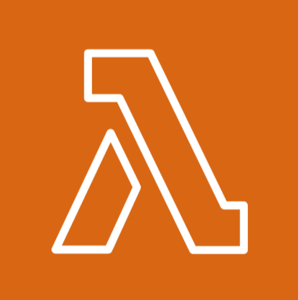

# AWS Lambda



## Overview

AWS Lambda is a serverless compute service that allows you to run code in response to events without managing servers. Simply upload your function code, and Lambda handles the patching, and infrastructure management.

## Functions

Lambda functions are triggered by events such as API calls, file uploads to `S3`, or messages from services like SNS. Functions are stateless by default, meaning they don’t retain information between executions. AWS also supports stateful workflows using services like `DynamoDB` or `Step Functions`.

## Benefits of Serverless:

- **No Server Management**: Focus on writing code without dealing with infrastructure.
- **Automatic Scaling**: Functions automatically scale to handle any level of traffic.
- **Cost-Efficient**: You only pay for the compute time when your code runs.

## Example: Writing an AWS Lambda Function in Python

The [AWS Lambda with Python documentation](https://docs.aws.amazon.com/lambda/latest/dg/lambda-python.html) includes the following example code snippet for writing a Lambda function in Python:

```python
import boto3
import botocore

def lambda_handler(event, context):
    print(f'boto3 version: {boto3.__version__}')
    print(f'botocore version: {botocore.__version__}')
```

In this example, the `boto3` library is used, which is the AWS SDK (Software Development Kit) for Python. This library allows your Python applications to interact with various AWS services, such as Lambda, S3, and EC2. The code also imports `botocore`, which is a low-level library that `boto3` relies on for making API requests to AWS services.

## Creating a Lambda Function

To create a Lambda function, you need a deployment package. The deployment package is a .zip file archive or container image that contains your function code and any external libraries used in the code. However, you do not need to include `boto3` in the dependencies, since it is already included in the AWS Lambda Python runtime environment.

## Installing boto3

If you're testing or developing your Lambda function locally, you will need to install the `boto3` library using pip. Run the following command:

```bash
pip install boto3
```

## 📚 Further Reading

- **[AWS Lambda Overview](https://aws.amazon.com/lambda/)**  
  Official AWS documentation on AWS Lambda, its use cases, and features.

- **[Boto3 Lambda Service Reference](https://boto3.amazonaws.com/v1/documentation/api/latest/reference/services/lambda.html)**  
  Boto3 documentation for interacting with AWS Lambda using the AWS SDK for Python (Boto3).

- **[Using AWS Lambda with Python](https://docs.aws.amazon.com/lambda/latest/dg/lambda-python.html)**  
  AWS documentation on how to develop AWS Lambda functions using Python.
