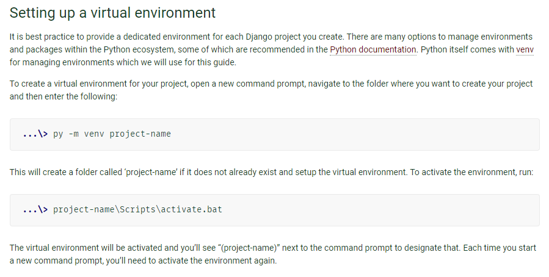
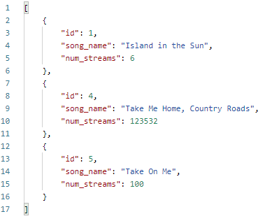
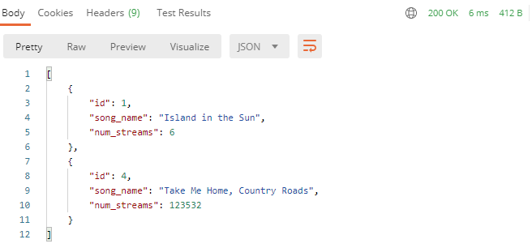
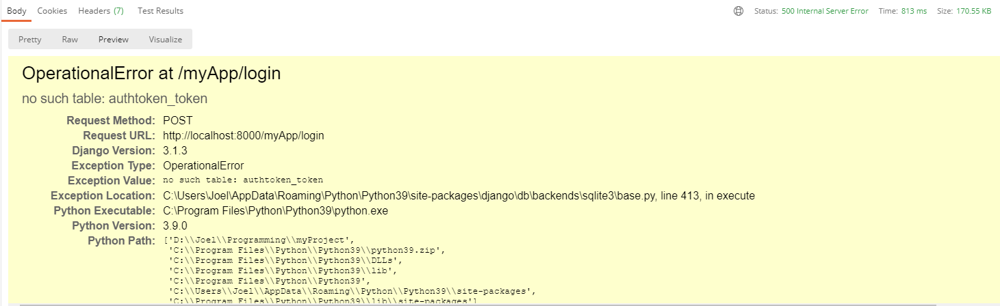
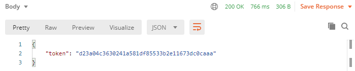
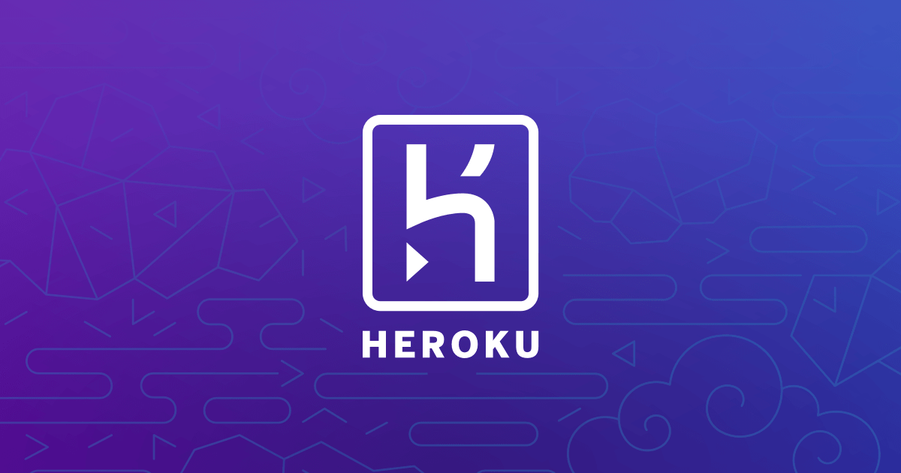

@import url(https://themes.googleusercontent.com/fonts/css?kit=GGSdX60RftK6aXtKOXIPy9RoJpxaJb5UUpN7GEfuLgUdiua4L87OCJcA85rGauDFgmKqFASrP2XauyrtHJV9\_A);.lst-kix\_66bzwlrrnpss-2>li:before{content:"" counter(lst-ctn-kix\_66bzwlrrnpss-2,lower-roman) ". "}.lst-kix\_2u3jf2zbpk4c-0>li:before{content:"- "}.lst-kix\_my83e53ve3i8-3>li:before{content:"\0025cf "}.lst-kix\_my83e53ve3i8-5>li:before{content:"\0025a0 "}.lst-kix\_66bzwlrrnpss-0>li:before{content:"" counter(lst-ctn-kix\_66bzwlrrnpss-0,decimal) ". "}.lst-kix\_66bzwlrrnpss-4>li:before{content:"" counter(lst-ctn-kix\_66bzwlrrnpss-4,lower-latin) ". "}.lst-kix\_66bzwlrrnpss-6>li{counter-increment:lst-ctn-kix\_66bzwlrrnpss-6}.lst-kix\_66bzwlrrnpss-3>li:before{content:"" counter(lst-ctn-kix\_66bzwlrrnpss-3,decimal) ". "}.lst-kix\_2u3jf2zbpk4c-1>li:before{content:"- "}.lst-kix\_my83e53ve3i8-0>li:before{content:"\0025cf "}.lst-kix\_my83e53ve3i8-4>li:before{content:"\0025cb "}.lst-kix\_66bzwlrrnpss-6>li:before{content:"" counter(lst-ctn-kix\_66bzwlrrnpss-6,decimal) ". "}ul.lst-kix\_q2yxkx3ji6qk-8{list-style-type:none}ul.lst-kix\_q2yxkx3ji6qk-6{list-style-type:none}ul.lst-kix\_q2yxkx3ji6qk-7{list-style-type:none}.lst-kix\_my83e53ve3i8-1>li:before{content:"\0025cb "}.lst-kix\_66bzwlrrnpss-5>li:before{content:"" counter(lst-ctn-kix\_66bzwlrrnpss-5,lower-roman) ". "}.lst-kix\_my83e53ve3i8-2>li:before{content:"\0025a0 "}ul.lst-kix\_q2yxkx3ji6qk-0{list-style-type:none}ul.lst-kix\_q2yxkx3ji6qk-1{list-style-type:none}.lst-kix\_2u3jf2zbpk4c-6>li:before{content:"- "}ol.lst-kix\_66bzwlrrnpss-1.start{counter-reset:lst-ctn-kix\_66bzwlrrnpss-1 0}.lst-kix\_66bzwlrrnpss-8>li:before{content:"" counter(lst-ctn-kix\_66bzwlrrnpss-8,lower-roman) ". "}ul.lst-kix\_q2yxkx3ji6qk-4{list-style-type:none}ul.lst-kix\_q2yxkx3ji6qk-5{list-style-type:none}.lst-kix\_umg48yypugih-1>li:before{content:"\0025cb "}.lst-kix\_66bzwlrrnpss-7>li:before{content:"" counter(lst-ctn-kix\_66bzwlrrnpss-7,lower-latin) ". "}ul.lst-kix\_q2yxkx3ji6qk-2{list-style-type:none}.lst-kix\_2u3jf2zbpk4c-5>li:before{content:"- "}ul.lst-kix\_q2yxkx3ji6qk-3{list-style-type:none}.lst-kix\_my83e53ve3i8-8>li:before{content:"\0025a0 "}.lst-kix\_umg48yypugih-0>li:before{content:"\0025cf "}.lst-kix\_2u3jf2zbpk4c-2>li:before{content:"- "}.lst-kix\_2u3jf2zbpk4c-4>li:before{content:"- "}.lst-kix\_my83e53ve3i8-7>li:before{content:"\0025cb "}.lst-kix\_2u3jf2zbpk4c-3>li:before{content:"- "}.lst-kix\_my83e53ve3i8-6>li:before{content:"\0025cf "}ul.lst-kix\_2u3jf2zbpk4c-1{list-style-type:none}ul.lst-kix\_2u3jf2zbpk4c-2{list-style-type:none}ol.lst-kix\_66bzwlrrnpss-4.start{counter-reset:lst-ctn-kix\_66bzwlrrnpss-4 0}ul.lst-kix\_2u3jf2zbpk4c-3{list-style-type:none}ul.lst-kix\_2u3jf2zbpk4c-4{list-style-type:none}ul.lst-kix\_2u3jf2zbpk4c-5{list-style-type:none}ul.lst-kix\_2u3jf2zbpk4c-6{list-style-type:none}ul.lst-kix\_2u3jf2zbpk4c-7{list-style-type:none}ul.lst-kix\_2u3jf2zbpk4c-8{list-style-type:none}ul.lst-kix\_2u3jf2zbpk4c-0{list-style-type:none}.lst-kix\_66bzwlrrnpss-4>li{counter-increment:lst-ctn-kix\_66bzwlrrnpss-4}.lst-kix\_66bzwlrrnpss-7>li{counter-increment:lst-ctn-kix\_66bzwlrrnpss-7}ul.lst-kix\_umg48yypugih-1{list-style-type:none}ul.lst-kix\_umg48yypugih-2{list-style-type:none}ul.lst-kix\_umg48yypugih-0{list-style-type:none}.lst-kix\_q2yxkx3ji6qk-5>li:before{content:"\0025a0 "}.lst-kix\_q2yxkx3ji6qk-6>li:before{content:"\0025cf "}.lst-kix\_q2yxkx3ji6qk-7>li:before{content:"\0025cb "}ol.lst-kix\_66bzwlrrnpss-7.start{counter-reset:lst-ctn-kix\_66bzwlrrnpss-7 0}.lst-kix\_q2yxkx3ji6qk-8>li:before{content:"\0025a0 "}ul.lst-kix\_umg48yypugih-5{list-style-type:none}ul.lst-kix\_umg48yypugih-6{list-style-type:none}ul.lst-kix\_umg48yypugih-3{list-style-type:none}ul.lst-kix\_umg48yypugih-4{list-style-type:none}ul.lst-kix\_umg48yypugih-7{list-style-type:none}ul.lst-kix\_umg48yypugih-8{list-style-type:none}.lst-kix\_66bzwlrrnpss-2>li{counter-increment:lst-ctn-kix\_66bzwlrrnpss-2}.lst-kix\_66bzwlrrnpss-8>li{counter-increment:lst-ctn-kix\_66bzwlrrnpss-8}ol.lst-kix\_66bzwlrrnpss-6.start{counter-reset:lst-ctn-kix\_66bzwlrrnpss-6 0}.lst-kix\_66bzwlrrnpss-5>li{counter-increment:lst-ctn-kix\_66bzwlrrnpss-5}ol.lst-kix\_66bzwlrrnpss-0.start{counter-reset:lst-ctn-kix\_66bzwlrrnpss-0 0}.lst-kix\_66bzwlrrnpss-1>li:before{content:"" counter(lst-ctn-kix\_66bzwlrrnpss-1,lower-latin) ". "}ol.lst-kix\_66bzwlrrnpss-5{list-style-type:none}ol.lst-kix\_66bzwlrrnpss-4{list-style-type:none}ol.lst-kix\_66bzwlrrnpss-7{list-style-type:none}ol.lst-kix\_66bzwlrrnpss-6{list-style-type:none}ol.lst-kix\_66bzwlrrnpss-1{list-style-type:none}ol.lst-kix\_66bzwlrrnpss-0{list-style-type:none}ol.lst-kix\_66bzwlrrnpss-3{list-style-type:none}ol.lst-kix\_66bzwlrrnpss-5.start{counter-reset:lst-ctn-kix\_66bzwlrrnpss-5 0}ol.lst-kix\_66bzwlrrnpss-2{list-style-type:none}.lst-kix\_66bzwlrrnpss-0>li{counter-increment:lst-ctn-kix\_66bzwlrrnpss-0}ol.lst-kix\_66bzwlrrnpss-8{list-style-type:none}ol.lst-kix\_66bzwlrrnpss-2.start{counter-reset:lst-ctn-kix\_66bzwlrrnpss-2 0}.lst-kix\_q2yxkx3ji6qk-4>li:before{content:"\0025cb "}.lst-kix\_q2yxkx3ji6qk-3>li:before{content:"\0025cf "}.lst-kix\_q2yxkx3ji6qk-2>li:before{content:"\0025a0 "}.lst-kix\_66bzwlrrnpss-1>li{counter-increment:lst-ctn-kix\_66bzwlrrnpss-1}ol.lst-kix\_66bzwlrrnpss-8.start{counter-reset:lst-ctn-kix\_66bzwlrrnpss-8 0}.lst-kix\_q2yxkx3ji6qk-0>li:before{content:"\0025cf "}.lst-kix\_q2yxkx3ji6qk-1>li:before{content:"\0025cb "}ol.lst-kix\_66bzwlrrnpss-3.start{counter-reset:lst-ctn-kix\_66bzwlrrnpss-3 0}.lst-kix\_66bzwlrrnpss-3>li{counter-increment:lst-ctn-kix\_66bzwlrrnpss-3}.lst-kix\_umg48yypugih-2>li:before{content:"\0025a0 "}li.li-bullet-0:before{margin-left:-18pt;white-space:nowrap;display:inline-block;min-width:18pt}.lst-kix\_umg48yypugih-3>li:before{content:"\0025cf "}.lst-kix\_2u3jf2zbpk4c-7>li:before{content:"- "}.lst-kix\_umg48yypugih-4>li:before{content:"\0025cb "}.lst-kix\_2u3jf2zbpk4c-8>li:before{content:"- "}.lst-kix\_umg48yypugih-5>li:before{content:"\0025a0 "}ul.lst-kix\_my83e53ve3i8-1{list-style-type:none}ul.lst-kix\_my83e53ve3i8-0{list-style-type:none}.lst-kix\_umg48yypugih-8>li:before{content:"\0025a0 "}ul.lst-kix\_my83e53ve3i8-3{list-style-type:none}ul.lst-kix\_my83e53ve3i8-2{list-style-type:none}ul.lst-kix\_my83e53ve3i8-5{list-style-type:none}ul.lst-kix\_my83e53ve3i8-4{list-style-type:none}.lst-kix\_umg48yypugih-6>li:before{content:"\0025cf "}ul.lst-kix\_my83e53ve3i8-7{list-style-type:none}ul.lst-kix\_my83e53ve3i8-6{list-style-type:none}.lst-kix\_umg48yypugih-7>li:before{content:"\0025cb "}ul.lst-kix\_my83e53ve3i8-8{list-style-type:none}ol{margin:0;padding:0}table td,table th{padding:0}.c71{border-right-style:solid;padding:5pt 5pt 5pt 5pt;border-bottom-color:#000000;border-top-width:1pt;border-right-width:1pt;border-left-color:#000000;vertical-align:top;border-right-color:#000000;border-left-width:1pt;border-top-style:solid;background-color:#000000;border-left-style:solid;border-bottom-width:1pt;width:480.8pt;border-top-color:#000000;border-bottom-style:solid}.c9{border-right-style:solid;padding:5pt 5pt 5pt 5pt;border-bottom-color:#000000;border-top-width:1pt;border-right-width:1pt;border-left-color:#000000;vertical-align:top;border-right-color:#000000;border-left-width:1pt;border-top-style:solid;border-left-style:solid;border-bottom-width:1pt;width:66pt;border-top-color:#000000;border-bottom-style:solid}.c21{border-right-style:solid;padding:5pt 5pt 5pt 5pt;border-bottom-color:#000000;border-top-width:1pt;border-right-width:1pt;border-left-color:#000000;vertical-align:top;border-right-color:#000000;border-left-width:1pt;border-top-style:solid;border-left-style:solid;border-bottom-width:1pt;width:402pt;border-top-color:#000000;border-bottom-style:solid}.c43{border-right-style:solid;padding:5pt 5pt 5pt 5pt;border-bottom-color:#000000;border-top-width:1pt;border-right-width:1pt;border-left-color:#000000;vertical-align:top;border-right-color:#000000;border-left-width:1pt;border-top-style:solid;border-left-style:solid;border-bottom-width:1pt;width:468pt;border-top-color:#000000;border-bottom-style:solid}.c31{margin-left:15pt;padding-top:11pt;padding-bottom:11pt;line-height:1.15;orphans:2;widows:2;text-align:left;margin-right:15pt}.c4{background-color:#1e1e1e;padding-top:0pt;padding-bottom:0pt;line-height:1.3571428571428572;orphans:2;widows:2;text-align:left}.c48{padding-top:18pt;padding-bottom:6pt;line-height:1.15;page-break-after:avoid;orphans:2;widows:2;text-align:left}.c26{padding-top:16pt;padding-bottom:4pt;line-height:1.15;page-break-after:avoid;orphans:2;widows:2;text-align:left}.c3{padding-top:0pt;padding-bottom:0pt;line-height:1.15;orphans:2;widows:2;text-align:left;height:11pt}.c2{color:#000000;font-weight:400;text-decoration:none;vertical-align:baseline;font-size:11pt;font-family:"Arial";font-style:normal}.c14{color:#666666;font-weight:400;text-decoration:none;vertical-align:baseline;font-size:11pt;font-family:"Arial";font-style:normal}.c40{padding-top:11pt;padding-bottom:11pt;line-height:1.15;orphans:2;widows:2;text-align:left;margin-right:15pt}.c6{padding-top:0pt;padding-bottom:0pt;line-height:1.15;orphans:2;widows:2;text-align:left}.c55{padding-top:8pt;padding-bottom:0pt;line-height:1.15;orphans:2;widows:2;text-align:left}.c53{padding-top:0pt;padding-bottom:8pt;line-height:1.42857;orphans:2;widows:2;text-align:left}.c44{padding-top:0pt;padding-bottom:0pt;line-height:1.15;orphans:2;widows:2;text-align:center}.c39{padding-top:0pt;padding-bottom:8pt;line-height:1.15;orphans:2;widows:2;text-align:left}.c38{color:#000000;font-weight:400;text-decoration:none;vertical-align:baseline;font-size:11pt;font-family:"Arial"}.c29{background-color:#1e1e1e;padding-top:0pt;padding-bottom:0pt;line-height:1.3571428571428572;text-align:left}.c30{background-color:#f5f5f5;font-size:9pt;font-family:"Courier New";color:#93a1a1;font-weight:400}.c33{background-color:#f5f5f5;font-size:9pt;font-family:"Courier New";color:#48484c;font-weight:400}.c35{background-color:#fcfcfd;font-size:10.5pt;font-family:"Courier New";color:#3f3f44;font-weight:400}.c47{font-weight:400;text-decoration:none;vertical-align:baseline;font-size:10pt;font-family:"Arial"}.c52{text-decoration:none;vertical-align:baseline;font-size:11pt;font-family:"Arial"}.c73{margin-left:auto;border-spacing:0;border-collapse:collapse;margin-right:auto}.c0{font-size:10.5pt;font-family:"Courier New";color:#4ec9b0;font-weight:400}.c1{font-size:10.5pt;font-family:"Courier New";color:#d4d4d4;font-weight:400}.c11{font-size:10.5pt;font-family:"Courier New";color:#c586c0;font-weight:400}.c41{color:#4fc1ff;font-weight:400;font-size:17pt;font-family:"Comfortaa"}.c7{font-size:10.5pt;font-family:"Courier New";color:#dcdcaa;font-weight:400}.c27{color:#6a9955;font-weight:400;font-size:10.5pt;font-family:"Courier New"}.c56{text-decoration:none;vertical-align:baseline;font-size:6pt;font-family:"Arial"}.c22{border-spacing:0;border-collapse:collapse;margin-right:auto}.c20{padding-top:0pt;padding-bottom:0pt;line-height:1.0;text-align:left}.c25{color:#000000;font-weight:400;font-size:16pt;font-family:"Arial"}.c5{font-size:10.5pt;font-family:"Courier New";color:#9cdcfe;font-weight:400}.c67{background-color:#f5f5f5;font-size:9pt;font-family:"Courier New";color:#dd1144}.c18{font-size:10.5pt;font-family:"Courier New";color:#ce9178;font-weight:400}.c17{font-size:10.5pt;font-family:"Courier New";color:#0c4b33;font-weight:400}.c13{text-decoration-skip-ink:none;-webkit-text-decoration-skip:none;color:#1155cc;text-decoration:underline}.c8{font-size:10.5pt;font-family:"Courier New";color:#569cd6;font-weight:400}.c34{color:#000000;font-weight:400;font-size:24pt;font-family:"Comfortaa"}.c79{color:#0c3c26;font-size:10.5pt;font-family:"Roboto"}.c15{text-decoration:none;vertical-align:baseline;font-style:normal}.c61{background-color:#000000;font-size:16pt;font-family:"Comfortaa"}.c16{text-decoration-skip-ink:none;-webkit-text-decoration-skip:none;text-decoration:underline}.c68{color:#434343;font-size:14pt;font-family:"Arial"}.c76{vertical-align:baseline;font-size:11pt;font-family:"Arial"}.c42{font-size:10.5pt;font-family:"Roboto";font-weight:400}.c37{font-size:10.5pt;font-family:"Courier New";font-weight:400}.c19{font-size:10.5pt;font-family:"Courier New";font-weight:700}.c60{font-size:23pt;font-family:"Comfortaa";color:#4fc1ff}.c75{background-color:#ffffff;max-width:468pt;padding:72pt 72pt 72pt 72pt}.c50{background-color:#f1f1f1;color:#222222}.c77{font-size:11pt;font-family:"Courier New"}.c69{font-size:9pt;font-family:"Comfortaa"}.c74{font-size:21pt;font-family:"Comfortaa"}.c24{color:inherit;text-decoration:inherit}.c45{padding:0;margin:0}.c32{margin-left:36pt;padding-left:0pt}.c70{color:#b7b7b7}.c12{color:#999999}.c58{color:#000080}.c57{font-style:normal}.c51{background-color:#ffff00}.c54{font-weight:400}.c23{height:0pt}.c49{color:#b5cea8}.c72{color:#666666}.c66{height:16pt}.c63{background-color:#00ff00}.c36{height:11pt}.c10{font-style:italic}.c59{font-size:10pt}.c28{font-weight:700}.c46{color:#000000}.c64{color:#4fc1ff}.c65{background-color:#f1f1f1}.c78{font-family:"Courier New"}.c62{background-color:#00ffff}.title{padding-top:0pt;color:#000000;font-size:26pt;padding-bottom:3pt;font-family:"Arial";line-height:1.15;page-break-after:avoid;orphans:2;widows:2;text-align:left}.subtitle{padding-top:0pt;color:#666666;font-size:15pt;padding-bottom:16pt;font-family:"Arial";line-height:1.15;page-break-after:avoid;orphans:2;widows:2;text-align:left}li{color:#000000;font-size:11pt;font-family:"Arial"}p{margin:0;color:#000000;font-size:11pt;font-family:"Arial"}h1{padding-top:20pt;color:#000000;font-size:20pt;padding-bottom:6pt;font-family:"Arial";line-height:1.15;page-break-after:avoid;orphans:2;widows:2;text-align:left}h2{padding-top:18pt;color:#000000;font-size:16pt;padding-bottom:6pt;font-family:"Arial";line-height:1.15;page-break-after:avoid;orphans:2;widows:2;text-align:left}h3{padding-top:16pt;color:#434343;font-size:14pt;padding-bottom:4pt;font-family:"Arial";line-height:1.15;page-break-after:avoid;orphans:2;widows:2;text-align:left}h4{padding-top:14pt;color:#666666;font-size:12pt;padding-bottom:4pt;font-family:"Arial";line-height:1.15;page-break-after:avoid;orphans:2;widows:2;text-align:left}h5{padding-top:12pt;color:#666666;font-size:11pt;padding-bottom:4pt;font-family:"Arial";line-height:1.15;page-break-after:avoid;orphans:2;widows:2;text-align:left}h6{padding-top:12pt;color:#666666;font-size:11pt;padding-bottom:4pt;font-family:"Arial";line-height:1.15;page-break-after:avoid;font-style:italic;orphans:2;widows:2;text-align:left}

|  |
| --- |
| Tech Start'sDjango Guide  |

Django is a free and open source python framework that lets you build awesome backends for websites, apps, and more. You can use it to host databases and build secure APIs for them without writing a line of SQL. You can also use it to create multi-page applications with dynamically served content. It makes it easy to get started building complex functionalities by automating a lot of the boilerplate code that you'd normally have to write. 

We recommend that you have a basic knowledge of python before using django! This will help you debug any errors that you get.

(Img src: [https://medium.com/crowdbotics/when-to-use-django-and-when-not-to-9f62f55f693b](https://www.google.com/url?q=https://medium.com/crowdbotics/when-to-use-django-and-when-not-to-9f62f55f693b&sa=D&source=editors&ust=1696887299889437&usg=AOvVaw0JlnqVicdXp7RSQlWJF3r9))

---

Setup
-----

Before you get started with Django, you should set up your environment. You should have a recent version of Python installed. You can follow the directions here:

[https://docs.djangoproject.com/en/3.1/howto/windows/](https://www.google.com/url?q=https://docs.djangoproject.com/en/3.1/howto/windows/&sa=D&source=editors&ust=1696887299890210&usg=AOvVaw3gzZMiaf9iWTQ94bvuvPvE)

You should make a venv for your django project.

Video tutorial for venv windows: [https://www.youtube.com/watch?v=APOPm01BVrk](https://www.google.com/url?q=https://www.youtube.com/watch?v%3DAPOPm01BVrk&sa=D&source=editors&ust=1696887299890717&usg=AOvVaw1-y5ZIXe_fM7KZw1YXnw7-)

Video tutorial for venv mac/linux: [https://www.youtube.com/watch?v=Kg1Yvry\_Ydk](https://www.google.com/url?q=https://www.youtube.com/watch?v%3DKg1Yvry_Ydk&sa=D&source=editors&ust=1696887299890995&usg=AOvVaw0tTlEZuVi3DHHv4AsNF55A)

Note: if you're using Git Bash on windows, use  $ source venv/scripts/activate

When you're done using your virtual environment, just enter $ deactivate

[https://docs.djangoproject.com/en/3.1/intro/tutorial01/](https://www.google.com/url?q=https://docs.djangoproject.com/en/3.1/intro/tutorial01/&sa=D&source=editors&ust=1696887299891673&usg=AOvVaw1dfHIxMx5bgLvjTGUVhAVF)

$ python -m pip install Django

Get Django installed once you have created your virtual environment.

  $  python -m django --version 

// Checks if you have django installed

Next, cd into the folder which you want to contain your project and run the following command:

  $ django-admin startproject pNameHere

// starts project. cd into pNameHere folder.

|  |
| --- |
| Good to know: Projects vs. appsWhat’s the difference between a django project and a django app? An app is a Web application that does something – e.g., a Weblog system, a database of public records or a small poll app. A project is a collection of configuration and apps for a particular website. A project can contain multiple apps. An app can be in multiple projects. |

  $ python manage.py startapp yourAppName

This creates an app within your project. You'll need to be in the same folder that holds your project's manage.py

Next step: include your app in the INSTALLED\_APPS fields in settings.py (just the name)

INSTALLED\_APPS = [

    'django.contrib.admin',

    'django.contrib.auth',

    'django.contrib.contenttypes',

    'django.contrib.sessions',

    'django.contrib.messages',

    'django.contrib.staticfiles',

    #Add your app name like this!

    'myAppName',

]

Writing Models
--------------

Models allow you to define the content of your database. If you don't need content in your database, you won't need models.

You can follow along with this section here:

[https://docs.djangoproject.com/en/3.1/intro/tutorial02/](https://www.google.com/url?q=https://docs.djangoproject.com/en/3.1/intro/tutorial02/&sa=D&source=editors&ust=1696887299896219&usg=AOvVaw2zqV39d9Zvo6k6yIdV7mz2)

More about models: [https://docs.djangoproject.com/en/3.1/topics/db/models/](https://www.google.com/url?q=https://docs.djangoproject.com/en/3.1/topics/db/models/&sa=D&source=editors&ust=1696887299896648&usg=AOvVaw1DjPq0laj3KeM_21OZK9HT)

You will define all your models in models.py, located within the folder for your app.

from django.db import models

# Create your models here.

class Album(models.Model):

    name = models.CharField(max\_length=200)

    artist = models.CharField(max\_length=100)

    year\_released = models.DateField()

    def \_\_str\_\_(self):

        return str(self.name)

class Song(models.Model):

    song\_name = models.CharField(max\_length=100)

    album = models.ForeignKey(Album, on\_delete=models.CASCADE)

    num\_streams = models.IntegerField()

    def \_\_str\_\_(self):

        return str(self.song\_name)

Each model should correspond to the structure of a table of a relational model of a database. If you don't know what this means, ask someone who has taken CPSC 471 (or an equivalent databases course)

Django can convert these into real SQL tables!

* Good to know: Primary Keys: In the above example we didn't specify any ids for our models (normally, with databases, you want an id to be your primary key). Django automatically creates an ID field to be the primary key for each model and takes care of auto-incrementing, unless you specifically override it. I don't recommend overriding, it's not worth the effort (and its doubly complicated and not worth it to have a primary key composed of several fields)
* Good to know: \_\_str\_\_: the \_\_str\_\_ function is Python's default function for string representation. In this case, it's good practice to override this for your models. This will help you understand your data if you login via the admin view (I'll show how to do this later)
* Good to know: Foreign Keys: See the Song model class for how you can reference a foreign key belonging to another model (in this case it refers to Album). You don't need to refer to a foreign model's keys directly, all you need to do is specify which table you are referencing. Also note: if you are referring to a table, it needs to be defined above the point in the code where you are referring to it.

There are more options that can be explored about how you can define your models, but this should be a good base for you to do your own research :)

Now we're ready to convert these into a real database! By default, Django will make a sqlite file that has your database.

|  |
| --- |
| Converting models into your database[https://docs.djangoproject.com/en/3.1/intro/tutorial02/](https://www.google.com/url?q=https://docs.djangoproject.com/en/3.1/intro/tutorial02/&sa=D&source=editors&ust=1696887299905250&usg=AOvVaw3HVTy9VMavMa8JbLqi5NWw)>> python manage.py makemigrations appNameCreates migrations for the changes you made in appName>> python manage.py migrateMigrates the changes you made into your database |

Run your app
------------

Whenever you are ready to run your server, just call this command!

>> python manage.py runserver 

By default, this will run the Django server on localhost:8000. View the django documentation to see how you can run it on a different port. You can now access it from your web browser by visiting [http://localhost:8000](https://www.google.com/url?q=http://localhost:8000&sa=D&source=editors&ust=1696887299907099&usg=AOvVaw246BCnOww8vGAUwSxxFq_4) !

You can also create a superuser (admin) to view the inner contents of your database. To do this, you first need to create them from the command line using the following command:

>> python manage.py createsuperuser --username yourNameHere --email [yours@email.ca](mailto:yours@email.ca)

This will create a super user with your provided info (it will prompt you to enter a password as well). 

The following command creates a token for the superuser that you can use for authentication in requests. If you are not using Django Rest Framework, this is not applicable to you.

>> python manage.py drf\_create\_token yourSuperUserName

Note: if you're trying to run these for your deployed app on heroku, you need to prepend heroku run before those commands! See the Heroku section for a description on how you can deploy it. 

You can see the admin page of your website to view the inner content of your database. This is automatically created by Django. Visit [http://localhost:8000/admin](https://www.google.com/url?q=http://localhost:8000/admin&sa=D&source=editors&ust=1696887299908544&usg=AOvVaw2u-RwV1aQlRmYmdjk7z0rm) and enter your passcode. 

If you want your models to show up in the admin page, you will need to specify them in admin.py like this:

from django.contrib import admin

from .models import Album, Song

# Register your models here.

admin.site.register(Album)

admin.site.register(Song)

Once you log in to the admin site, you should see something like this. From here, you can add & remove database entries. 

URLs
----

URLs allow you to define the paths that exist in your system, and what happens when you call them.

 

URLs documentation: [https://docs.djangoproject.com/en/3.1/ref/urls/](https://www.google.com/url?q=https://docs.djangoproject.com/en/3.1/ref/urls/&sa=D&source=editors&ust=1696887299910681&usg=AOvVaw3I1UM_9LP10BaUVVo30sz9)

How URLs are processed in Django: [https://docs.djangoproject.com/en/3.1/topics/http/urls/#how-django-processes-a-request](https://www.google.com/url?q=https://docs.djangoproject.com/en/3.1/topics/http/urls/%23how-django-processes-a-request&sa=D&source=editors&ust=1696887299911073&usg=AOvVaw2Oq1i4jiYL65slMbgl9mm5)

Read more: [https://docs.djangoproject.com/en/3.1/intro/tutorial03/](https://www.google.com/url?q=https://docs.djangoproject.com/en/3.1/intro/tutorial03/&sa=D&source=editors&ust=1696887299911597&usg=AOvVaw3qqU35TDwdjLV02Nb1_z_F)

If you're constructing a big application, it's standard practice in django to include different apps for each part of your system, and link them to the main project.

However, since we're only making small-scale side-projects, it's fine to ignore this best-practice and include everything in a single app. Just understand that in a large industrial scale project you wouldn't necessarily want to do this.

// urls.py in a project:

from django.contrib import admin

from django.urls import path, include

urlpatterns = [

    path('admin/', admin.site.urls),

    path('myApp/', include('myApp.urls'))

]

// example urls.py in myApp folder:

from django.urls import path

from . import views

urlpatterns = [

    path('hello\_world', views.ping, name='Hello World!'),

    path('hello-x/<str:hello\_to>', views.hellox, name='Hello to x'),

    path('hello-x/<print\_me>/print', views.printx, name='Print this!'),

    path('goodbye', views.goodbye, name='goodbye'),

]

Now you can visit a path using [http://localhost:8000/myApp/hello-world](https://www.google.com/url?q=http://localhost:8000/myApp/hello-world&sa=D&source=editors&ust=1696887299915906&usg=AOvVaw3jKzEmK8i9ztaAoKl5TlU4), for example.

Views
-----

Views allow you to define what happens when you access a certain url in your system (using your browser, an API tool like Postman, or something else altogether). In your views, you could define interactions with the model (your database) or entirely different interactions altogether. You can use the definition of the view to call external processes.

If you want to make more complicated views and understand the Request and Response items, read this: 

[https://docs.djangoproject.com/en/3.1/ref/request-response/](https://www.google.com/url?q=https://docs.djangoproject.com/en/3.1/ref/request-response/&sa=D&source=editors&ust=1696887299917271&usg=AOvVaw1szy9bViH4jKASSsn4iWpG)

To understand views more in-depth, read the documentation: [https://docs.djangoproject.com/en/3.1/topics/http/views/](https://www.google.com/url?q=https://docs.djangoproject.com/en/3.1/topics/http/views/&sa=D&source=editors&ust=1696887299918000&usg=AOvVaw0HjxG7BtwMFPxwoQ0Ysgc0)

Here are some simple examples of what you can do with a view. Note that these are just examples and don't represent best practice at all. 

from django.http import HttpResponse, response

# views.py

def ping(request):

    myRes = "Hello World!"

    return HttpResponse(myRes)

def hellox(request, hello\_to):

    myRes = {"My Reply": "Hello " + hello\_to}

    return response.JsonResponse(myRes)

def printx(request, print\_me):

    print("Hello to " + print\_me)

    return response.HttpResponseNotFound("I printed it!")

def goodbye(request):

    if not (request.method == 'GET'):

        return response.HttpResponseBadRequest()

    queryParams = request.GET

    msg = queryParams.get('msg', "Gamers")

    return response.JsonResponse({"Reply": "Goodbye " + msg})

Now, we want to adhere to DRY (Don't repeat yourself) when creating views. Therefore, it is almost always best to define your views as Class-Based views (CBVs) which handle more of the boiler plate code for you and help ensure your views follow standards.

Please read more about class-based views here: [https://docs.djangoproject.com/en/3.1/topics/class-based-views/](https://www.google.com/url?q=https://docs.djangoproject.com/en/3.1/topics/class-based-views/&sa=D&source=editors&ust=1696887299923246&usg=AOvVaw09jGiN8IfX4zyYQ1n8LWuI)

Both the above docs and the docs for views also show how you can interact with your database items through a view. But, if you're building an API, I highly recommend using the tools in the following section: Django REST Framework.

Once you have defined your views and given them a corresponding url, you can test them out. 

>> python manage.py runserver 

Run your server, and using either a web browser, or preferably an API testing tool like Postman ([https://www.postman.com/](https://www.google.com/url?q=https://www.postman.com/&sa=D&source=editors&ust=1696887299924017&usg=AOvVaw2lEj_-eabd4060zZ49Ju38))  access the proper urls (ex. [http://localhost:8000/myApp/hello\_world](https://www.google.com/url?q=http://localhost:8000/myApp/hello_world&sa=D&source=editors&ust=1696887299924274&usg=AOvVaw0PfbvuCX7WV1eKqbnvva13)) to see if they have the expected behavior. 

---

Django REST Framework
---------------------

Django REST Framework is an add-on to Django that makes it simple to develop REST-compliant APIs. There is great documentation here: [https://www.django-rest-framework.org/](https://www.google.com/url?q=https://www.django-rest-framework.org/&sa=D&source=editors&ust=1696887299925074&usg=AOvVaw1ej3b3G_iWkXmiYPpu8Z9B) <--- FOLLOW INSTALL INSTRUCTIONS

What is a RESTful framework? Learn more here: [https://restfulapi.net/](https://www.google.com/url?q=https://restfulapi.net/&sa=D&source=editors&ust=1696887299925521&usg=AOvVaw31oQ72mj-ApmtVeU9GlN-j)

Django REST Framework provides you with tools to make class-based views to easily implement database CRUD (Create Read Update Destroy) operations, as well as define more complex operations. 

Before we define any endpoints with Django REST Framework, let's make some serializers.

### Serializers

Django REST Framework uses serializers as a way to perform translation of your models from your python code and your database into data formats like JSON and XML that an API might use. Read more about them here:

[https://www.django-rest-framework.org/api-guide/serializers/](https://www.google.com/url?q=https://www.django-rest-framework.org/api-guide/serializers/&sa=D&source=editors&ust=1696887299926673&usg=AOvVaw0KGBecZcGEw6jkEEtHrMYc)

We should define some basic serializers so that we can make API endpoints that interact with the content of our database models.

1. Create a new file called serializers.py inside the app you want to use serializers with.
2. Create your serializers. Give them a relevant name (though the exact syntax is not important)
3. List the fields that you want your serializer to translate. If you don't want it to translate a particular field, then don't include it.

Here's an example, using the Song and Album models we defined earlier. Here's what's at the top of serializers.py:

from rest\_framework import serializers

from .models import \*

class SongSerializer(serializers.ModelSerializer):

    class Meta:

        model = Song

        fields = ("id", "song\_name", "num\_streams")

class AlbumSerializer(serializers.ModelSerializer):

    class Meta:

        model = Album

        fields = ("name", "year\_released", "artist", "id")

Make sure your fields match exactly the names that you used in your models.

You may be curious why I also included an id, when we didn't define one in our models- this is because Django auto generated an id for us in this models because we didn't specify a primary key. This id field always has the name id. It is often useful for our API, so we'll include it. 

We can also create multiple serializers for the same models, if we wanted different behavior. For example, what if we wanted to include the album id of the song?

class SongSerializerWithAlbumId(serializers.ModelSerializer):

    class Meta:

        model = Song

        fields = ("id", "song\_name", "num\_streams", "album")

This would include the album's PK (in this case, it's id, but if the PK was different, it'd be something else).

What if we wanted to include the full album info when an api request was made to see the song? Here's another example serializer that we could make:

class SongSerializerFullAlbum(serializers.ModelSerializer):

    myFullAlbumDesc = AlbumSerializer("album", read\_only=True)

    class Meta:

        model = Song

        fields = ("id", "song\_name", "num\_streams", "myFullAlbumDesc")

It's using our album serializer from earlier to serialize a field, which must (read only is an optional parameter that makes it so that it's only included in reading requests, not create/update/destroy.)

This was just an introduction to serializers. If you want to use more complex behaviors, you'll have to do the research on your own.

### Django REST Framework: Class based Views

|  |
| --- |
| Pre-requisite to this section: understand URLS and views in vanilla Django, and read the serializers section |

More reading: [https://www.django-rest-framework.org/tutorial/3-class-based-views/](https://www.google.com/url?q=https://www.django-rest-framework.org/tutorial/3-class-based-views/&sa=D&source=editors&ust=1696887299935395&usg=AOvVaw2_z6CELv80bBbN-98bJW_F)

Video overview of similar topic: [https://www.youtube.com/watch?v=akvFA5VMXJU](https://www.google.com/url?q=https://www.youtube.com/watch?v%3DakvFA5VMXJU&sa=D&source=editors&ust=1696887299935793&usg=AOvVaw0WyZP_92SJNiBm-dHhFJVv)

You can use Django's Class Based Views to quickly create views that can do CRUD (Create, Read, Update, Destroy) operations on your database.

In views.py:

from rest\_framework.views import APIView

from rest\_framework import generics

from rest\_framework import status

from .models import \*

from .serializers import \*

Some class based views that we'll define. Right now these are just the generic create, read, update, destroy views. By defining these views with the classes, Django REST Framework takes care of the default behavior for us. It's that easy!

class SaveSong(generics.CreateAPIView):

    queryset = Song.objects.all()

    serializer\_class = SongSerializerWithAlbumId

class GetSongs(generics.ListAPIView):

    queryset = Song.objects.all()

    serializer\_class = SongSerializer

class DeleteSong(generics.DestroyAPIView):

    queryset = Song.objects.all()

    serializer\_class = SongSerializer

class UpdateSong(generics.RetrieveUpdateAPIView):

    queryset = Song.objects.all()

    serializer\_class = SongSerializerWithAlbumId

Notice that we need to make the create and update serializers include the album ID- if we didn't then you couldn't create song objects since their album id must be not null.This same principal applies to any model that has a foreign key which isn't allowed to be null. 

Before we can use the views we created, we need to hook them up to a URL, just like you would for any other view. Do keep in mind that we need to call the as-view function on them, though. Here is an example of the URLs for the previous views. This pattern is how we normally define CRUD endpoint urls for any entity in a database

    path('song', views.GetSongs.as\_view(), name='songs'),

    # Create a song

    path('song/create', views.SaveSong.as\_view(), name='Save Song'),

    #Updates a specified license with information

    path('song/<int:pk>', views.UpdateSong.as\_view(), name='Update Song'),

    # Deletes a song specified by pk

    path('song/<int:pk>/delete', views.DeleteSong.as\_view(), name='Delete Song'),

If you are using a pk that is not an int (you manually defined a pk instead of using the default id generated), you'll have to specify that accordingly.

What if we want more complex behavior beyond the default predefined classes? We can modify them to add more conditions to what is returned.

In this example, we added an optional way to filter songs by album, using a query\_param called album. You'll need to read documentation and tutorials if you want to know more about the custom behavior you can define within your Django REST Framework views.

class GetSongInAlbum(generics.ListAPIView):

    serializer\_class = SongSerializer

    def get\_queryset(self):

        queryset = Song.objects.all()

        alb = self.request.query\_params.get('album', None)

        queryset = queryset.filter(album=alb)

        return queryset

If you have a view that isn't necessarily linked to CRUD actions, or has more complex usage and needs more custom defined behavior, you can use APIView. 

### Test out your Django REST API

Compile and run your app with 

$ python manage.py runserver 

Use your bugfixing wizardry to fix any errors that might show up. Now you should be ready to give those predefined endpoints you made for a spin!

Here's some examples that I did using Postman for API testing. If you used Django REST Framework, it should also come with a built-in API testing tool that you can use in your browser.

Here's a simple GET request. This is a database read operation, and it's pretty simple. Your browser is making GET requests to every URL you visit while you surf the web.

|  |  |
| --- | --- |
| Request |  |
| Response |  |

Here's a POST request (it's post because we're creating or Posting new data) to our create route. We should include the key-value pairs for the song we want to create in the Body of our request.

|  |  |
| --- | --- |
| Request |  |
| Response |  |

To update, let's follow the URL pattern we defined with the pk of the song we want to update. We can use PUT or PATCH. The info you're sending should be in the Body of the request, just like it was for our POST request.

|  |  |
| --- | --- |
| Request |  |
| Response |  |

Let's do the same thing for our deleteSong view, but let's delete Taylor's song this time (pk: 2). I'm sure it was no good anyways. 

|  |  |
| --- | --- |
| Request |  |
| Response |  |

Let's use our GET view to see what's inside the DB now:

\*\*unimportant note: in my zeal to delete taylor's song I had a mishap and accidentally deleted song 3, which I have readded here using a post request. but it's id is now 5 :[

Finally, let's try out that "song with album" route. We'll add it to our urls.py:

    # Probably not the best naming convention

    path('songInAlbum', views.GetSongInAlbum.as\_view(), name='Get song in album'),

Here's what our request will look like.  ^^^^^^^^

Here's the response:

|  |
| --- |
| Good to know: Query ParametersNotice how our query params don't have to be specified in urls.py - they are dynamically generated from the URL that we try access (everything that comes after a ? in a url is a query parameter, with keys and values separated by '='. If you had multiple query parameters they would be separated by '&'. Next time you're browsing the web, notice how query parameters are used across the different websites you visit!It's easy to access query params within Django - see the getSongInAlbum view definition for an example. |

Authtokens, users, logins with Django REST Framework
----------------------------------------------------

Up to now, we've covered the fundamentals of how to create a database, populate it, and create simple endpoints for creating, updating, and destroying. But what happens when we want our system to be used by real users? How do we store their information and their interactions with our system? There are a few important issues that we'll need to address:

* How do we make sure that users' personal information like their passcodes are being stored in a secure way that protects them from being stolen?
* How do we build a system that users can sign up for and log in to? How do we store info about their session?
* How do we make certain endpoints in our system behave differently depending on the user who is accessing them?

The answer to these questions can be complicated. In order to save your time and energy, we're going to utilize the resources that Django and Django REST Framework provide for us as much as possible instead of developing our own solutions. Not only is this easier, but it's also much more secure- would you trust a system written from scratch by a novice undergrad student with your password and financial information?

How do we store user's personal info?

The answer to this question is usually to use Django's built-in User model. You can read the docs on User models here:

[https://docs.djangoproject.com/en/3.1/ref/contrib/auth/](https://www.google.com/url?q=https://docs.djangoproject.com/en/3.1/ref/contrib/auth/&sa=D&source=editors&ust=1696887299957250&usg=AOvVaw0VJrbVTEuA4MyOdSK8mhxz)

The User model contains common fields that will be used by users, and in your serializers you can define which fields are relevant to your use case.

By default, Django builds the User models for you. You can see them after you runserver and check inside the /admin route.

 

We can also utilize the User model to build new endpoints in our API, just like we could with any other model. Here's an example:

## Models.py

from django.contrib.auth.models import User

…

class UserLikesSong(models.Model):

    user = models.ForeignKey(User, on\_delete=models.CASCADE)

    song = models.ForeignKey(Song, on\_delete=models.CASCADE)

## Serializers.py

class UserLikesSongSerializer(serializers.ModelSerializer):

    class Meta:

        model = UserLikesSong

        fields = ("id", "user", "song")

        #Id of the rel, Id of the user, ID of the song

You can now make endpoints with this just like you would with any other model/serializer. This specific example could be used to track what songs the User likes, like in Spotify. 

If you wanted to make a custom User model, you could read more about it here [https://simpleisbetterthancomplex.com/tutorial/2016/07/22/how-to-extend-django-user-model.html](https://www.google.com/url?q=https://simpleisbetterthancomplex.com/tutorial/2016/07/22/how-to-extend-django-user-model.html&sa=D&source=editors&ust=1696887299961131&usg=AOvVaw2MwtZ4JpcVxnUjSP2rIDpN) and do more research, as there are many methods you could use. For basic university usage though, it's 99% of the time going to be faster and easier to roll with the User model they give you out of the box.

If you want to give different categories of users different permissions, see the permissions section (TODO: this won't be done for a while. In the meantime, these links may help: [https://www.django-rest-framework.org/api-guide/permissions/](https://www.google.com/url?q=https://www.django-rest-framework.org/api-guide/permissions/&sa=D&source=editors&ust=1696887299961666&usg=AOvVaw1ObgMGAm2AcDPjy7q5pOUR) ← Technical overview

[https://www.django-rest-framework.org/tutorial/4-authentication-and-permissions/](https://www.google.com/url?q=https://www.django-rest-framework.org/tutorial/4-authentication-and-permissions/&sa=D&source=editors&ust=1696887299961961&usg=AOvVaw0LOnBdPcgJ4izyZlu9MDWf) ← Basic usage example)

Signup, Login, Sessions: How do we do them?

I highly recommend using Django REST Framework's Authtokens to handle information about user sessions. You can read about authtokens, as well as the other options available, here: [https://www.django-rest-framework.org/api-guide/authentication/#tokenauthentication](https://www.google.com/url?q=https://www.django-rest-framework.org/api-guide/authentication/%23tokenauthentication&sa=D&source=editors&ust=1696887299962701&usg=AOvVaw3qaIov2YW9uutyVl6xqTs1)

To add Authtoken's, make sure the following items appear in settings.py:

###### You will need to add the REST Framework part.

###### INSTALLED\_APPS should already exist.

REST\_FRAMEWORK = {

    'DEFAULT\_AUTHENTICATION\_CLASSES': [

        'rest\_framework.authentication.TokenAuthentication',  

    ],

}

INSTALLED\_APPS = [ # There will be more here

  'rest\_framework',

  'rest\_framework.authtoken',

]

|  |
| --- |
| Note: I couldn't get these to work, at least not with authtoken. Leaving them here in case some enterprising individual finds them useful, or message us on Discord if you figure this out :)To get REST Framework's default login and logout views (prebuilt), type this in your project's root urls.py file: urlpatterns = [    ...    path('api-auth/', include('rest\_framework.urls'))]Your path doesn't have to be api-auth, it can be whatever you want. |

To use REST Framework's login view, include this in urls.py:

    path('whateverPathYouWantToLogin', obtain\_auth\_token, name='API Token Login'),

Include this at top of your urls.py:

from rest\_framework.authtoken.views import obtain\_auth\_token

 

When you access this path and provide a real username and password in the request body, then you should receive an authtoken. This authtoken is associated with your account. Store this authtoken in a safe place. Now, you can use it in the "authorization" section of your next HTTP requests, and all requests you make from the client will be associated with the account you just logged in from.

Creating views for signing up is more difficult.

|  |
| --- |
| In serializers.py:from django.contrib.auth.models import User class RegisterSerializer(serializers.ModelSerializer):    class Meta:        model = User        fields = ('id','username','password')#Change fields if u want        extra\_kwargs = {            'password':{'write\_only': True},        }    def create(self, validated\_data):        user = User.objects.create\_user(validated\_data['username'],     password = validated\_data['password'])        return userThis serializer will make sure that the password that the user makes is valid, and that it's write-only for security purposes. Choose which fields us |
| In views.py:from django.contrib.auth import get\_user\_model # If used custom user modelfrom rest\_framework import permissions #We'll discuss more about perms later …class RegisterUserView(generics.CreateAPIView):    model = get\_user\_model() #Will get the right one if you use custom    permission\_classes = [        permissions.AllowAny # Or anon users can't register    ]    serializer\_class = RegisterSerializer #What we defined above |
| In urls.py:    path('register', views.CreateUserView.as\_view(), name='Register user'),(you may want to put your register / login views together in a different Django App (so they are in a distinct section of your API) |
| Test Request in Postman:Response from request: |

Now let's quickly do a login from this user we just created!

I did a login request to the login view I made earlier, but here's what I got:

Whenever you see an error like "no such table", that should be a clue that you need to rerun migrations. The app expected there to be a SQL table, but there was none made yet! Running migrations will ensure there is. Recall the commands for migrations are:

>> python manage.py makemigrations yourAppName

>> python manage.py migrate

In this case, just the second command will be sufficient

Request:

Response:

Yay! It worked! Now we can include this token in our request headers to associate all future requests made with the user we logged in.

In future requests, you should put the token as a value in your request headers, using the key: token.

  
Depending on the front-end you build, you should use a different way to store the authtoken that you get from logging in. Usually storing in local memory is okay. Do your own research for how to store authtokens with whatever system you are using.

If you want to improve security further, you can use JWT (JSON webtoken) instead, following the instructions here: [https://simpleisbetterthancomplex.com/tutorial/2018/12/19/how-to-use-jwt-authentication-with-django-rest-framework.html](https://www.google.com/url?q=https://simpleisbetterthancomplex.com/tutorial/2018/12/19/how-to-use-jwt-authentication-with-django-rest-framework.html&sa=D&source=editors&ust=1696887299977678&usg=AOvVaw1MZTMGA2TguwwvhS7uTlKc)

How do we make endpoints behave differently depending on which user is accessing them?

If a user makes a request while they are authenticated (using authtoken, or some other alternative method), then the system will automatically know what user is associated with the user who made the request. 

You can access the user within a class-based view through 

 self.request.user

You can use this within your views in a variety of ways: to filter, to make more complex queries, and to check if the user should have access. 

For example, let's make a UserLikesSong endpoint that is limited to the songs that the currently logged in user has liked.

class GetUserLikesSongs(generics.ListAPIView):

    def get\_queryset(self):

        queryset = UserLikesSong.objects.all()

        queryset = queryset.filter(user=self.request.user)

        # Leftside of filter: from queryset. Rightside: how we're filtering

        return queryset

    serializer\_class = UserLikesSongSerializer

We'll cover this in much more detail in the Permissions section.

Permissions
-----------

|  |
| --- |
| NOTE: Everything past here is incomplete - you will need to supplement it with your own research, like I did to make this guide! |

To use generic permissions with Django, all you need to do is:

* In your views.py:

from rest\_framework.permissions import IsAdminUser, IsAuthenticated, IsAuthenticatedOrReadOnly

Now, on any class-based view you want to guard with permissions, you can add the following line:

class deleteLicenseType(generics.DestroyAPIView):

    permission\_classes = [IsAdminUser]

    queryset = License\_Type.objects.all()

    serializer\_class = License\_TypeSerializer

(this is from a different project)

You can apply multiple permissions to the same view like this:

    permission\_classes = [IsAdminUser|IsAuthenticatedOrReadOnly]

Sessions & Cookies
------------------

Sessions/cookies are very easy to make use of with Django. You can use cookies to store information in a user's browser that you'll be able to access in all subsequent requests that a user makes. One example of a good use of sessions/cookies is to store a user's shopping cart content.

Some great videos for learning about sessions & cookies:

[https://www.youtube.com/watch?v=C75IW38hKI8](https://www.google.com/url?q=https://www.youtube.com/watch?v%3DC75IW38hKI8&sa=D&source=editors&ust=1696887299984122&usg=AOvVaw1BlFZi-ukfvS7Zg85iNeaD)

[https://www.youtube.com/watch?v=RjykNmVdcgI](https://www.google.com/url?q=https://www.youtube.com/watch?v%3DRjykNmVdcgI&sa=D&source=editors&ust=1696887299984570&usg=AOvVaw1SY_LjCGIlsZ-pyC9Kory9)

Deploy to Heroku
----------------

To get your projects online, you can deploy them to Heroku. Heroku is just one of several possible hosting services for Django- but it's base tier is free, easy to use, and simple to deploy to, so that's what I recommend you use. The biggest downside of using Heroku is that its free tier will automatically shut down your app after a period of downtime, meaning it'll take a long time to respond the next time you try to access it. 

A guide on getting started:

[https://devcenter.heroku.com/articles/django-app-configuration](https://www.google.com/url?q=https://devcenter.heroku.com/articles/django-app-configuration&sa=D&source=editors&ust=1696887299985429&usg=AOvVaw2RvfTSWEeSUq0yGBtDru9P)

Some useful commands:

>> pip install gunicorn

To deploy to Heroku, you will need to make a file called Procfile (no file ending), and add the following gunicorn text to it:

web: gunicorn yourAppName.wsgi

This gunicorn file should be at the same level as your manage.py file. When you deploy to Heroku, you should be deploying from this level of the project hierarchy to avoid issues.

Your remote heroku environment needs to understand what requirements it will need to have to start up. You can do this by providing it with a requirements.txt file which will also be at the same level as your manage.py file.

To get the right requirements in a .txt file, type

>> pip freeze > requirements.txt

These commands will help initialize your heroku repository:

>> heroku create

>> heroku run python manage.py migrate

>> heroku run python manage.py createsuperuser

Important: Your database itself will not transfer to Heroku. You will need to recreate all entities, config, and users.
