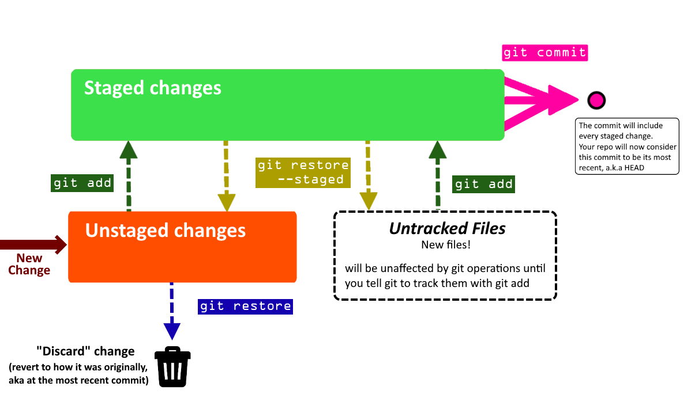
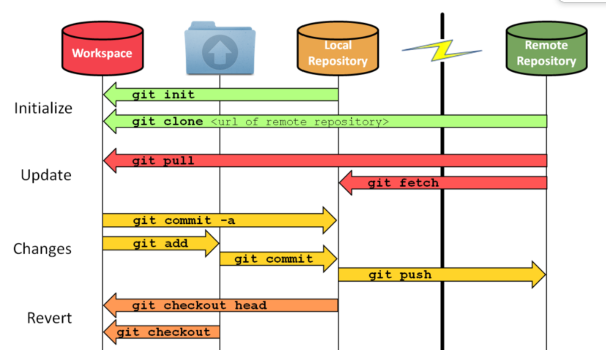
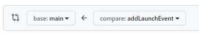

|  |
| --- |
# Tech Start's Git Guide 

## Legend

=== Beginner Section ===

1. [Getting Started](#h.ng16jwsqm0hq)
2. [Staging Files & Commits](#h.qc71mohn2dt2)
3. [Big Picture & Git Analogy](#h.v4pxj7b3yt84)
4. [Staging Files & Creating Commits](#h.qc71mohn2dt2)
5. [Branches](#h.zaka16ynnh9p)
6. [Remote Repositories](#h.15pehstk3g26)
7. [Merge Conflicts](#h.mtsw8xgn0ufq)
8. [Using Github](#h.f5khd0tbm89b)
9. [Our Recommended Git Workflow](#h.p2hraqx6wkzq)
10. [FAQ](#h.xzp2mwoj3k9v)

=== Advanced Section ===

11. Advanced Staging & Commits
12. Git Stash
13. Git Clean
14. [Undoing Commits & Changes](#h.2spd0i8oye6o)

Unless otherwise noted, all git commands are one line terminal commands

We are also assuming that you have set up a project at /path/to/project and had “cd’ed” to /path/to/project

## Getting Started - Setting up a Repository

[https://docs.github.com/en/enterprise-server@2.22/get-started](https://www.google.com/url?q=https://docs.github.com/en/enterprise-server@2.22/get-started&sa=D&source=editors&ust=1696888782344227&usg=AOvVaw1O2_1GDr4cAi_VdEyUGNOf)

A Git Repository is virtual storage of your code, allowing you to save versions of your code, as well as share and allow others to edit the code.

Initializing a new repository: git init

* This step is typically used by the project manager, or the owner of the project

Cloning an existing repository: git clone [github git link]

* This step is typically used by the project members, or anyones who wants to add onto the projects after it has already been created
* The github git link can be located on the github repository website under the clone dropdown

## Big Picture & Git Analogy

Imagine that we have two people working on the same paper remotely, Person A and Person B. Now we notice that Person B is the laziest of the two, so Person A starts the paper. 

Since they are unaware of Google Docs, Person A choses to create a word document on their local machine. This can be seen as Initializing a new repository.

After working on the paper for a bit, he realizes that Person B also needs to contribute, so they send the paper by email to Person B. This step is equivalent to forking a repository.

Person B decides that he would prefer to work on the paper by hand, and so he takes the email that Person A sent, and prints it to work on, cloning the repository 

## Staging Files & Creating Commits

Git works using units of change called commits. These commits are essentially snapshots of your project. To share any changes, additions, and deletions that you make with other people and upload it to the internet, you will need to package them into a commit first.

The process of staging files to create a commit is like an assembly line at a factory. The final product of this process is a commit, and you can use commands like 

You can think of the staging area of git (the green box that says "staged changes" in the below diagram) like a box. You can add and remove changes from the box on a per-file-basis. 

Committing is like sealing that box and sticking a label on it. The contents of that box are your changes. But, if there are changes in the untracked or unstaged areas, they will not be included in the commit, because they are outside of the box.

The following diagram shows how the staging process works, and what commands you can use to move changes on a per-file-basis in between areas. Use the git status command to see a summary of where every change in your project is on this diagram! We recommend using git status frequently. 

## 

Shown are some common commands for using git to store and prepare the code to be pushed to the remote repository. They are shown in the general order that you want to use them in. 

Below is the legend for some common, optional parameters which are shown 

* (-text) = optional parameters for command, which are called as is (git command -text)
* [textName]  = optional parameters for command, which are called with your version of the name (git command helloWorld)

|  |  |
| --- | --- |
| git status | Shows the status of all changes (changes that have been staged, NOT been staged, or NOT yet been committed). It shows where every change is on the diagram above, and even lists some helpful commands.It will also say what branch you are on, and if you are ahead or behind the remote version of your branch in terms of commits (more on this in later sections).Additionally, if you have a merge conflict, it will show which files caused it.  |
| git add [file path] | selects the specified files, moves it to the “staging area” and includes it in the next commitThis command will also allow adding a deleted file to be staged, which after being committed and pushed will remove the file from the git branch\*\*This command will ignore all files in the “.gitignore” file \*\** [file path] File path expression. Any files which match the expression are acted upon by git add.
 |
| git commit -m “[commitMessage]” | Creates a new commit that includes all changes that you added to the staging area.You always need to include a name for your commit. It is helpful to be as descriptive as possible!If you don't use the -m flag and provide a commit message in quotations, git will make you write a commit message using a text editor. However, this can be very confusing for people especially since your default git text editor is often configured to be VIM (if it is, you can type :qa to exit). For this reason, we recommend always specifying the commit message using -m.  After you commit, these changes are no longer in the staging area- they are in your commit! * (-m) means you will be specifying a commit message in quotations
* “[commitMessage]” the message that will be attached to the commit. Only usable if -m or -am is used, otherwise a text editor will appear for the commit message
 |
| git restore [file path] | Discards local changes in a file, thereby restoring its last committed state.You can use it to quickly get rid of accidental or unnecessary changes, restoring your files to how they used to be before you changed them.It won't work if your file is already staged - you'll have to unstage it with git restore --staged first. |
| git restore --staged [file path] | Removes the file from the Staging Area, but preserve all modifications you made to it.You can use it if you accidentally added a file to the staging area whose changes shouldn't be included as part of the next commit you are planning to make. If the file was originally untracked, it becomes untracked again. If it was originally a file with unstaged changes, the changes become unstaged again. |

Naming commits

When you create a commit, you always want to include a descriptive name for the commit that describes exactly what it accomplishes. You wouldn’t label a moving box with kitchen items as simply “stuff.” 

For a video tutorial on staging files, watch [https://www.youtube.com/watch?v=KngvG8WzYLU&ab\_channel=TheNetNinja](https://www.google.com/url?q=https://www.youtube.com/watch?v%3DKngvG8WzYLU%26ab_channel%3DTheNetNinja&sa=D&source=editors&ust=1696888782359378&usg=AOvVaw1L7RXcvPY-2tAkM6eFiKKO)

If you want to learn about additional flags and commands you can use in the process of staging files and adding commits, see the section [Advanced Staging & Commits](#h.bp4dfayml2ey) 

## Branches

Branches represent an independent version of the code. They allow new features to be worked on, while ensuring that a working version of the code is not tampered with. This allows large changes to be made to the code base, with little fear of breaking larger projects.

|  |  |
| --- | --- |
| git branch | Lists all branches in the current repository |
| git branch [branchName] | Creates a branch called branchName in the current repository.The created branch's commit history will match the branch you were on when you called git branch. We recommend naming branches according to what you want your branch to do. For example, if I was updating the font on a website, I might call my branch updateFont. You may also want to add a prefix to the branch name to indicate it is your branch (this is optional- example, I could call my branch joel/updateFont.) |
| git branch -d [branchName] | Deletes the branch called branchName (You can use -D instead of -d to force delete the specified branch, even is it has unmerged changes. It's typically better to use -d, unless you are 100% sure you will never need the branch you are deleting again) |
| git checkout [branchName] | Navigates your current directory to the specified branch, allows you to select which line of development you are working on.You can only switch branches if you have no unstaged/staged changes in your current branch. If you can't switch branches because of this, see What happens if you can't checkout? for more instructions. |

How should you use branches?

Whenever you are working on a new feature, or conducting a test/messing with code, you should create a new branch to use. 

Before you make your branch, you should make sure you are creating your branch based on the most recent code. Do git checkout main (or master instead of main) to switch to the primary branch of your repository. You will also probably want to do git pull to make sure the primary branch is up to date with the version present on your remote repository (more on this in the next section).

Now that you are on the primary branch, use git branch [branchName] to create a new branch based on the current one. Make sure you name it according to what you aim to accomplish there (see the description of the command above).

Now that you have created your branch, you'll want to switch to it. Use git checkout [branchName] to switch to your branch. You can do work here and follow the instructions in the staging files and creating commits section to save your changes into commits.

Eventually, you'll be done using the branch (perhaps you will follow the instructions in the next few sections to push it to your remote repository and use it in a pull request. or perhaps you need to work somewhere else). Either way, you can switch to a different branch with git checkout [branchName].

If you have completed a pull request for your branch to merge it into a different branch of your project, you no longer need to keep the local copy of your branch. We recommend you use git branch -d to delete any branches you will no longer need to use. This makes sure your local repository remains nice and tidy.

What happens if you can't checkout?

Git will not let you checkout to switch branches if you have staged or unstaged changes. 

You will have a few choices on what to do:

* Restore files to how they originally were (either by manually undoing, or by making use of git restore, described in the previous section). Do this if any of your changes are unnecessary or accidental.
* Create a commit, following instructions from the previous section. Only create a commit if you actually want to save the changes you made. We recommend you avoid making commits on any branches that you share with other people, especially your primary branch (main/master)!
* Utilize git stash to move changes from one branch to another without needing to commit them. Do this if your changes are intentional, but you wanted them on a different branch than the one you are currently on. This is described in more detail [here.](#h.ncn9ba95tavq)

You can combine these approaches to deal with your changes as necessary.

## Remote Repositories

When you work with git, you will typically have a local repository (the copy of your project that exists on your personal device) and a remote repository (the copy of your project that exists on the internet, usually on a service like GitHub or BitBucket)

An absolutely core part of using Git is managing the interactions between your local repository and the associated remote repository. The two key commands you will need to learn are git push (which you can use to push commits from your local repository to the remote repository) and git pull (which you can use to pull commits from the remote repository and insert them into your own local repository). We have more info on how to use these commands appropriately below.

A common mistake that newcomers to git will make is assuming that the local repository is the same as the remote repository- when they're actually 2 separate concepts. Your commits won't appear on the remote repository until you manually push them there. If someone else pushes new changes to the remote repository, you won't see their changes on your local repository until you manually pull those changes to your device.

Most version control related work happens in a local repository(staging, committing, viewing status and logs). When you start working with others on the same project, is when remote repositories come into play. It is like a file server that you use to exchange data with others.

|  |  |
| --- | --- |
| Local | Remote |
| Are located on the computers of the team members | Are on the internet or a local network |
| Contains branches, commits, tags | Contains branches, commits, tags |
| All “coding work” happens only in the local repository, and needs to be made and committed locally. | After the work has been committed locally, it can be “uploaded” to the remote repository in order to share with others. |

Note: You can name a local branch the same name as the remote branch/repository, but they are NOT the same

Note: You can also have multiple remote repositories(default is origin). This allows you to have multiple different working branches for new/different features of your code.

git fetch is what you do when you want to see what everybody else has been working on. it doesn’t force you to actually merge the changes into your repository. This makes fetching a safe way to review commits before integrating them with your local repository.

[https://www.git-tower.com/learn/git/ebook/en/command-line/remote-repositories/introduction/](https://www.google.com/url?q=https://www.git-tower.com/learn/git/ebook/en/command-line/remote-repositories/introduction/&sa=D&source=editors&ust=1696888782373371&usg=AOvVaw2jhppSn6bMDVlKtX9bosxy)

|  |  |
| --- | --- |
| git pull [remoteName] [branchName] | Pulls all changes/commits from the remote branch, and inserts them into your current branchMore technical description: fetches from the remote branch (git fetch), and merges your current branch with commits from the remote (git merge)\*\*You can “pull” before “pushing” to a branch to avoid unwanted merge conflicts and errors\*\** [remoteName][branchName] pulls from a specific branch, which you specify
 |
| git pull origin main | fetches commits from the master branch of the origin remote (into the local origin/master branch), and then it merges origin/master into the branch you currently have selected |
| git push | updates the remote branch with your staged, local commits\*\*Always “pull” before “pushing” to a branch to avoid unwanted merge conflicts and errors\*\* |

Make sure to PULL before every PUSH if you are collaborating with others.

## Merge Conflicts

Conflicts generally arise when two people have changed the same lines in a file, or if one developer deleted a file while another developer was modifying it. In these cases, Git cannot automatically determine what is correct. Git will mark the file as being conflicted and halt the merging process. It is then the developers' responsibility to resolve the conflict.

Resolving merge conflicts is a completely normal part of working collaboratively 

The general steps for resolving merge conflicts can be seen as:

1. Figure out the conflicts and change them accordingly
2. Re-commit the changes
3. Attempt to merge with the selected branches
4. Read error messages (if any) and repeat if necessary

Some useful commands for attempting to fix merge conflicts

|  |  |
| --- | --- |
| git status | Help identify conflicted files |
| git log --merge | Produces a log with a list of commits that conflict between the merging branches |
| git diff | Finds the differences between the states of a repository, which helps in preventing conflicts |
| git reset --mixed | Undo changes to the working directory and staging area |
|  |  |

### Example of Merge Conflicts shown in Command Line

In this case, there are two instances of the file “merge.text” that were modified by different branches/people. Git is unable to determine which lines to keep, as both were changed manually.

## Using GitHub

GitHub is a company that provides a service of hosting git repositories online. There are many other alternative companies that provide a similar service, like BitBucket, GitLab, and Azure DevOps, but GitHub is the most popular one and we recommend using it in this club.

The instructions for the rest of this section will focus on GitHub's features. However, almost every feature described here has equivalents in the other git hosts, so if you know how to use one you generally know how to use them all.

Pull requests

Video intro to pull requests:

[https://www.youtube.com/watch?v=2VX1ISk9XH8&ab\_channel=GitKraken](https://www.google.com/url?q=https://www.youtube.com/watch?v%3D2VX1ISk9XH8%26ab_channel%3DGitKraken&sa=D&source=editors&ust=1696888782384996&usg=AOvVaw3-tD-gx5meUZ02rK1-MfEd)

A pull request is a way of merging code from one branch of your remote repository into another.

You are requesting that the base branch pulls the commits from the compare branch. In the above example, you are requesting that the main branch pulls the commits from the addLaunchEvent.

We recommend you use pull requests extensively as part of your git workflow. 

We encourage teams to use small, frequent, single-feature PRs. Each PR should have a name that describes exactly what the PR accomplishes. By doing smaller PRs, you will make sure everyone frequently updates their codebase so you don't end up with massive merge conflicts. By limiting your PR to a single feature, you also make it super easy to roll back that feature and reverse all commits in the PR by reverting the PR itself.

Sometimes, when you create a pull request, it will say there is a merge conflict. If this happens, don't force the PR to merge! Instead, you'll want to resolve the merge conflict. Steps:

1. On your local machine, checkout to the "compare" branch -

(ex.  git checkout addLaunchEvent)

2. Once you are on the compare branch, do a git pull from the base branch of your PR

(ex. git pull origin main)

3. This will pull changes from the base into your compare branch. Git will notify you that this caused a merged conflict. This is okay!
4. Resolve the merge conflict according to the instructions in the [Merge Conflicts section](#h.mtsw8xgn0ufq). You'll need to add and commit the files where you solved the merge conflict.
5. Confirm you have resolved every merge conflict. Try running/building your app again to make sure everything works as expected.
6. Push the commit(s) that solved the merge conflict to your remote compare branch.

(ex. git push origin addLaunchEvent)

7. The pull request should now update saying there is no merge conflict! You can merge it now, as long as your team approves of it.

Advantages of pull requests:

* They enable your team to do pull request reviews (see more below)
* Your team can set up custom tests / deployments using CI/CD methods to ensure that your code runs as expected before you merge it
* It enables you to double check what code you are adding
* If you ever need to undo a pull request, it's very easy. Most git hosts have an easy way of reverting a pull request- usually it will create a new branch and PR itself, from which you can solve any merge conflicts and quickly roll back the code added from a previous PR.
* If you stick to coding 1 feature per pull request, it makes it very easy to understand the history of your repository

Additional readings on pull requests:

[https://product.hubspot.com/blog/git-and-github-tutorial-for-beginners](https://www.google.com/url?q=https://product.hubspot.com/blog/git-and-github-tutorial-for-beginners&sa=D&source=editors&ust=1696888782388511&usg=AOvVaw28uR6Gsv9svKIWWSP_AIst)

[https://yangsu.github.io/pull-request-tutorial/](https://www.google.com/url?q=https://yangsu.github.io/pull-request-tutorial/&sa=D&source=editors&ust=1696888782388925&usg=AOvVaw2cjhfn7WqhsfczArQiV-lF)

Pull Request Reviews

One of the main advantages of pull requests is that they enable you to do a pull request review, ensuring that code that gets pulled into your primary branches has been reviewed by your team to make sure it won't introduce code smells or bugs.

PRs provide the opportunity to review another developer's code and make sure that it meets the guidelines or practices that your organization or team has. For example, if you have a developer who is more familiar with the architecture of the software system, they can provide valuable input towards making sure that your changes fit within the long term architectural vision of the system. Alternatively, you can have a newer team member who is not yet familiar with the overall code structure and they can add comments to specific parts of the code in a PR to ask for further clarification for why a certain change was made. PRs have been an essential learning tool for me during the past 10 months of my internship.

Aside from learning, PRs generally serve as a major communication channel for developers in industry, because they provide the opportunity for automated testing and improvements before your code changes are moved to the next deployment stages. One example of automated testing is using linter which is a static code analysis tool used to flag errors in your code such as bugs, stylistics errors, and suspicious constructs, like for example declaring a variable twice.

Whenever someone wants to merge a pull request, you should require them to get their PR reviewed first. To review a pull request, look at all the changes they made. 

Best Practices for PR Contributors:

* Review your PR before adding reviewers.
* You may find some work-in-progress or experimental code. There could also be a typo, unintended indentation, or extra line breaks.

                

* Link your PR to your issue/ticket.
* Include a brief description of your changes
* Push small incremental commits to your PR.
* You can also mark your PR as a DRAFT PR in GitHub. This pre-commit review can be good practice to check with reviewers if you are going in the right direction before making any more code changes.

                

* Add additional comments to your PR to guide reviewers through the review.
* Highlight areas reviewers should focus on.
* Clarify changes with comments and additional references.
* Favor adding code comments over PR comments as the code comments will out survive the PR comments.

Best Practices for Reviewers

* Be fast, not furious
* Responsiveness and turnaround time are very important to keep PRs healthy and not go stale due to other changes which may have been merged during the time that the PR is open and may even introduce new merge conflicts.
* Either as a reviewer or as an author, you should keep the conversation actively going until the issue is resolved.
* As a rule of thumb, if the PR is small or trivial, you should review it within one business day.
* Plus, context switching is very expensive in industry. Many developers, like myself, have the memory of a goldfish when it comes to remembering the code we wrote a day ago. So, as a courtesy, you can let the developer who opened the PR know if you are planning on looking at their PR at a later time. If there are PRs open, it is also good practice to review them before you create a new one yourself.

                

* If there are outstanding comments or the PR is in draft mode, do not approve the PR.
* Instead, stay involved and follow the discussions and new changes to see how the PR pans out.

                

* Do NOT rubber stamp reviews.
* If you do not understand a change, you can ask for clarification or justification in the comments.
* You do not have to approve a PR if you are not actually approving the change. You can let the author know that you have completed your review but are not weighing in on the approval.
* Our TechStart website team's default PR policy requires approvals from 2 different reviewers, but an approval that is rubber stamped can be more harmful than abstaining if it promotes bad practices and bugs to be user-facing.

        

* Provide constructive comments
* Code reviews are an important step in ensuring we build high-quality software products. As a reviewer, it's your job to carefully read and think about the code you are reviewing, and provide constructive feedback or ask questions about the code if things are unclear.
* If the code isn't formatted correctly, too confusing, contains mistakes, or follows poor conventions, leave a comment to tell them what they did wrong and how they might be able to fix it (but phrase everything constructively! you don't want to seem rude or aggressive).
* If you disagree with something, give a reason and an example of a better solution. Let the author know exactly what you think is better.

GitHub and other git hosts support adding inline comments, so you can comment on specific areas of the code when necessary. The best place to do this is the "Files Changed" tab of a pull request.

It is up to them to address every issue that is brought up, and push the changes back to their branch. They should let you know when they've completed everything, and you can check to make sure you're happy with their changes. 

Issues

GitHub Issues are a great way of keeping track of tasks, bugs, and goals for your projects. We recommend using them as the primary way of assigning tasks to your team and planning out your dev work.

You can read more about issues here:

[https://guides.github.com/features/issues/](https://www.google.com/url?q=https://guides.github.com/features/issues/&sa=D&source=editors&ust=1696888782393713&usg=AOvVaw1SqSaKVL8wUfBPvfRY0Xct)

## Our recommended Git workflow

TODO: Describe how a team of developers should use branches to do versioning correctly

TODO: Describe possible failures that a developer may encounter in this process because of mistakes they made, and how to recover from them

Let's assume you have some commits on branch yourLocalBranch, and you want to merge them into a branch on your team's GitHub (which uses the default remote alias, origin) called branchYouWantToMergeTo.

Part 1 - Set up your branch

1. Ensure you are on the main branch of your repository. It is usually called main or master. If you are not on the main branch, switch to it with git checkout main (or master)
2. Pull the most recent version of your main branch from GitHub. You can do this with git pull origin main (or master). This will make sure your new branch contains all the most recent changes
3. Create a new branch for yourself. The name of the branch should describe what the code inside will do, and you should prefix it with your name or nickname. For example, git branch joel/changeButtonColor
4. Check out your new branch before you make any changes. Refer to Branches if you make any mistakes. Example: git checkout joel/changeButtonColor

Part 2 - Make your commits

5. Follow the instructions in the Staging Files and Adding Commits section to create a commit containing your desired changes. Use git status frequently to make sure you are doing everything correctly.

Part 3 - Push your commits to origin 

6. Push your branch to origin. Ex. git push origin joel/changeButtonColor
7. Set up a pull request on GitHub, with the base as main (or the branch you want to merge to) and the compare branch as your branch, (ex joel/changeButtonColor)
8. (Only if your pull request indicates you have a merge conflict): DO NOT merge the branch. Instead, do git pull origin main (or the branch you want to merge to) on your local machine. This will bring up the merge conflict.
9. Follow the instructions in "Merge Conflicts" to fix any merge conflicts that you get from pulling that branch. Once you have fixed all merge conflicts, remember to double check that your code runs, then git add and git commit your fixes!
10. Push your changes to your remote repository! Do git push origin yourLocalBranch
11. Now that your changes are present on your remote repository, you should create a pull request on GitHub. The base (target branch) should be branchYouWantToMergeTo, and the source should be yourLocalBranch.
12. Check to make sure the pull request says "No merge conflicts". If it does detect merge conflicts, that means you didn't do steps 4-7 correctly, so redo them!
13. Request a reviewer for your pull request. They will read your code and offer suggestions on how to improve it.
14. Resolve the comments of your reviewer. Once they are resolved and your reviewer confirms you can proceed, you can merge the pull request on GitHub. Congratulations! your code is now merged into your project.

Clean up

15. Delete your branch on the remote repository
16. Delete your branch on your local system (checkout to main. Then delete with git branch -d yourBranchName)

## Big Picture Git/GitHub Workflow

Now that you understand the complete process on an individual level, let's take a step back to understand how your team will be using git.

Here is the Git workflow we recommend:

(This is what is used at Microsoft. It works well and it's good practice to teach it)

1. When a team member wants to make changes or additions to the code, they should create a new branch for themselves. The branch name should describe what it does, ex. "fixButtonGlitch"
2. They push their code to a branch on your origin repo that shares the same name
3. When they're ready, they create a Pull Request on GitHub. The PR's source should be their branch, and the destination should be either master or main (whichever your repo is using).
4. They should describe their Pull Request in the description and provide screenshots if applicable
5. They merge their own PR, once the following 3 conditions are met:
1. There are no merge conflicts with the base branch
2. If your project has Continuous Integration (which it should), the PR build succeeds
3. At least 2 people have reviewed the code in the PR (more on code reviews later) and all comments from code reviews have been resolved
6. Upon merging the PR, they delete their branch.

## FAQ

List of questions that Joel got often:

* ### What should I do if I made a commit in the wrong branch?

        Refer to [undoing changes and commits](#h.2spd0i8oye6o)

* ### What should I do if I started work in the wrong branch but not committed yet?

            Refer to [undoing changes and commits](#h.2spd0i8oye6o)

* ### What if I want to revert a commit?

Refer to [undoing changes and commits](#h.2spd0i8oye6o)

* ### How do I push code from my local branch to a remote branch that has a different name?
* In order to push your branch to another remote branch, use the “git push” command and specify the remote name, the name of your local branch as the name of the remote branch
* ### How do I create a new local branch based on a pre-existing remote branch?

[https://www.git-tower.com/learn/git/faq/checkout-remote-branch/](https://www.google.com/url?q=https://www.git-tower.com/learn/git/faq/checkout-remote-branch/&sa=D&source=editors&ust=1696888782398886&usg=AOvVaw14izZky3oru8wrliSyiJE_)

* ### What do I do if my pull request says it has merge conflicts?

See [Merge Conflicts section](#h.mtsw8xgn0ufq)

Advanced Section

Here are some advanced git commands you can use to boost your git game to the next level. They are not essential to using git, but you may find them helpful. If you're still learning the beginner commands, we recommend focusing on them until you're comfortable with them before worrying about these advanced commands.

## Advanced Staging and Commits

Here are some additional commands and flags for existing commands that you can use while you are staging files and adding commits. 

If you want descriptions of the basic staging and commits, please see [staging files & creating commits](#h.qc71mohn2dt2) in the beginner part of the guide.

|  |  |
| --- | --- |
| git status (-s) (-v) | You can use the -s and -v flags on git status for the following effects:* (-s) displays information in a shortened and fast format
* (-v) displays information in more detail, with additions such as the textual changes of uncommitted files
 |
| git add [fileName or folderName](-u) | You can use the -u flag on git add for the following effects:* (-u) adds new/modified files and IGNORES deleted files to the staging area
 |
| git commit (-a) (-am) "[Commit message here]" | You can use the -a and -am flags on git commit for the following effects:* (-a) commits all files in the staging area
* (-am) commits all files in the staging area and allows the addition of the commit message in the command
* “[Commit message here]” the message that will be attached to the commit. Only usable if -m or -am is used, otherwise a text editor will appear for the commit message
 |

## Git Stash

[https://www.atlassian.com/git/tutorials/saving-changes/git-stash](https://www.google.com/url?q=https://www.atlassian.com/git/tutorials/saving-changes/git-stash&sa=D&source=editors&ust=1696888782404970&usg=AOvVaw1h6VYesnnWhcofYDJw8bUY)

WIP, should include push, pop, apply, list

## Git Clean

WIP, should include push, pop, apply, list

== didnt realize we already have git clean there, but we can do more detail here ==

## Undoing Commits & Changes

WIP

Below is the general sequence of commands to check, and undo previous commits. Notice that we must use the commit comments as the easiest factor in differentiating between commits. It is important to use a descriptive comment for each commit. 

|  |  |
| --- | --- |
| git log  | Displays old commits with the ID hash and commit comment on the current branch |
| git checkout [id hash] | Will make your working directory match the exact state of the id’ed commit\*nothing you do here will be saved to the current state of the project (to go back do “git checkout main”) |
| git clean (-f) (-n) | ‘git clean -n’ shows which UNTRACKED files will be removed, should you do ‘git clean -f’\*\* good practice is to always -n before you -f \*\*[https://www.theserverside.com/blog/Coffee-Talk-Java-News-Stories-and-Opinions/How-to-use-the-git-clean-command](https://www.google.com/url?q=https://www.theserverside.com/blog/Coffee-Talk-Java-News-Stories-and-Opinions/How-to-use-the-git-clean-command&sa=D&source=editors&ust=1696888782408402&usg=AOvVaw1kZxxIcxOTvcaCXNA4p96f)* (-n) runs a dry run (previews what files would be removed)
* (-f) to force untracked file detection (removes the files)
 |
| git revert | Undos a single commit |
| git reset [id hash] | Goes back to specified commit by removing all subsequent commits |

## Git Rebase and Git Merge

WIP

|  |  |
| --- | --- |
| git merge [branchName] | Merges the specified branch into the branch that your local directory is currently on.In a typical workflow, you will not need to use this command ever.Instead, git pull and pull requests will handle all merging for you. |

[[a]](#cmnt_ref1)Before thursday:

I will do touchups to all the beginner sections

Could you include an example in the merge conflicts section of how to solve a merge conflict?

Then let's add a little more for git stash because we might need push and pop when people inevitably make mistakes

