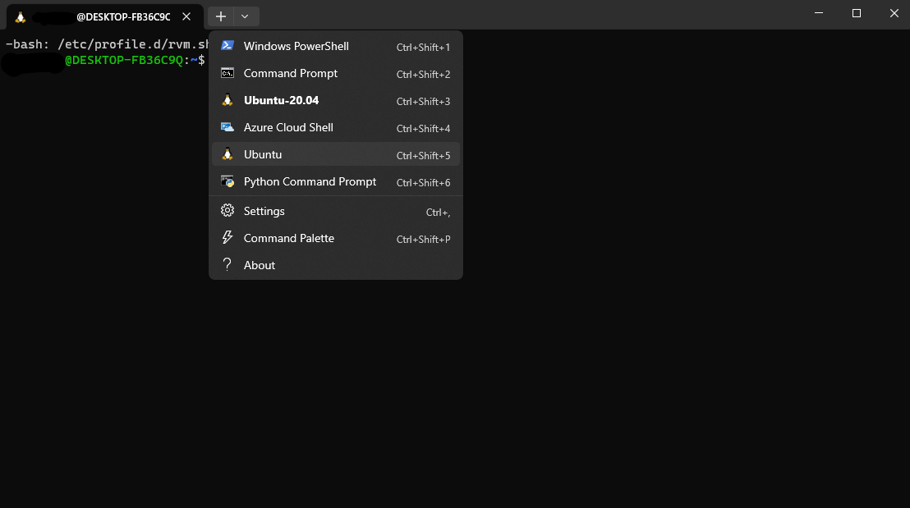

# WSL2 Installation

#### Introduction

WSL2 is a new version of the Windows Subsystem for Linux that is built on top of Hyper-V. It provides a full Linux kernel and userspace environment that runs natively on Windows. This means that you can run Linux applications on Windows without having to install a virtual machine or dual boot your computer. WSL2 is faster than WSL1 because it uses Hyper-V instead of VirtualBox. It also has better support for Docker and other container technologies.

#### Table of Contents
  - [Installing WSL2](#installing-wsl2)
  - [Installing Ubuntu](#installing-ubuntu)
  - [That's it!](#thats-it)
  - [I don't know how to use Linux, help!](#i-dont-know-how-to-use-linux-help)

#### Installing WSL2
To install WSL2, you need to have Windows 10 version 2004 or higher. To check your Windows version, open your Powershell and run the following command:

```bash
winver
```

If you have an older version of Windows, you can upgrade to the latest version by going to Settings > Update & Security > Windows Update > Check for updates.

Then search for `"Turn Windows features on or off"` in the start menu and open it.


Then check the box next to `"Windows Subsystem for Linux"` and `"Windows Hypervisor Platform"` and click OK. You will be prompted to restart your computer.


#### Installing Ubuntu

To install Ubuntu, go to the Microsoft Store and search for "Ubuntu". Then click on "Ubuntu 20.04 LTS" and click "Get".


Once installed, you can launch Ubuntu by opening the terminal from the start menu.


to switch to Ubuntu, click on the Ubuntu icon in the top left corner of the terminal window as shown below:



You can configure a default Ubuntu terminal by going to Settings > Terminal > Default profile > Ubuntu.


#### That's it! 
You have successfully installed WSL2 and Ubuntu. Now you can start using Linux applications on Windows without having to install a virtual machine or dual boot your computer. For your project we recommend using WSFL2 and Ubuntu as your development environment. If you are done working, you can close the terminal window and it will automatically shut down the Ubuntu environment. Continue the installfest here: [Installfest](../installfest/README.md)

#### I don't know how to use Linux, help!
If you are not familiar with Linux, we recommend that you take a look at the following resources:

- [Linux Journey](https://linuxjourney.com/)
- [Linux Command Line Basics](https://ubuntu.com/tutorials/command-line-for-beginners#1-overview)
- [Linux Command Line Cheat Sheet](https://cheatography.com/davechild/cheat-sheets/linux-command-line/)
- [Linux Command Line Tutorial](https://ryanstutorials.net/linuxtutorial/)

At minimum, you should learn the following commands:

- `pwd`
- `ls`
- `cd`
- `mkdir`
- `touch`
- `rm`
- `mv`
- `cp`
- `cat`
- `sudo`
