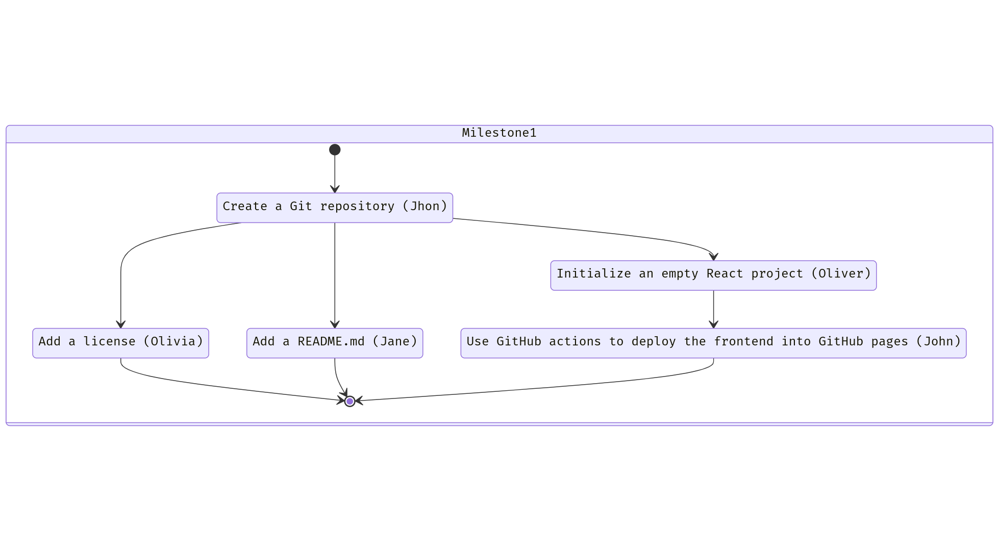
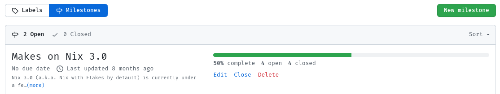

# A RoadMap

A RoadMap is one of the best ways to manifest the future vision of your product
and the strategy and steps
that will be used for achieving that vision.

A RoadMap is also a great tool to cooperate with other people
because you can prioritize on it the steps
that are yet to be done,
and see who's working on what,
what progress has been made,
and so on.

This is an example from the Makes project on GitHub:

That's a simple RoadMap, yet it has all the important information.
That's nice!

I highly recommend you create your RoadMap using the Projects feature on GitHub
because it integrates very well with other GitHub features
like Issues, Pull Requests and Milestones,
but it's also fine if you use [Jira](https://www.atlassian.com/software/jira)
or [Trello](https://trello.com/).

As a rule of thumb,
anything related to making your project awesome
can (and should) go into the RoadMap.
It's also not limited to just programming tasks,
you could perfectly add to the RoadMap
a meeting with your users,
some market research activity,
or having some Pizza with the team.

A RoadMap is also a living creature,
it evolves as the project evolves
and you can iterate on it on the go.
Don't worry if you don't get it perfectly from the beginning,
but make sure you have one from the beginning!

## How to create a RoadMap?

### Step 1 - Start with Milestones

My suggestion is that you start by creating a few
[Milestones](https://docs.github.com/en/issues/using-labels-and-milestones-to-track-work/about-milestones).

Think about what your project wants to achieve:
Is it maybe a website that allows you to shorten URLs,
like <https://tinyurl.com>?

What's the [minimum viable product](https://blog.crisp.se/2016/01/25/henrikkniberg/making-sense-of-mvp) that you can deliver to your users
so that they can start getting a taste?

You are right!
An ugly webpage, with an ugly textbox and an ugly button,
that when clicked, gives you a beautifully shortened URL :)

But that's even too far in the future.
What about making your first Milestone
about having an empty webpage?
Your second Milestone could be having a backend that answers a ping request.
Your third Milestone can be designing the database,
such that it stores the shortened URLs;
and your fourth Milestone can be adding the textbox and button to the front-end,
and an endpoint in the back-end that stores and retrieves the shortened URL.

You see?
we just planned a [minimum viable product](https://blog.crisp.se/2016/01/25/henrikkniberg/making-sense-of-mvp),
using an [agile methodology](https://learn.microsoft.com/en-us/devops/plan/what-is-agile).

Congratulations!

### Step 2 - Split the Milestones in smaller Issues

Now we can proceed to define the individual tasks (GitHub Issues)
that are needed for completing each Milestone,
and most importantly,
we can assign each member of our team an Issue,
and work collaboratively towards the same goal.

Bonus points if we can plan it so that they can all work in parallel.

For example,
for Milestone #1 (Having an empty webpage that the user can access),
we could create the following Issues:

In words:

- **Issue #1**: Create a Git repository.
  - Priority: Medium.
  - Assignee: John.
- **Issue #2**, after Issue #1: Add a license.
  - Priority: High.
  - Assignee: Olivia.
- **Issue #3**, after Issue #1: Add a README.md.
  - Priority: Medium.
  - Assignee: Jane.
- **Issue #4**, after Issue #1: Initialize an empty React project.
  - Priority: Medium.
  - Assignee: Oliver.
- **Issue #5**, after Issue #4: Use GitHub actions to deploy the front-end into GitHub pages.
  - Priority: Medium.
  - Assignee: John. (John should be free, since finishing #4 means #1 was finished).

Boom! Done.

Now create more Issues for all of the other Milestones.

### Step 3 - Add your Issues to the RoadMap

My suggestion for this is to keep it simple.
Avoid too many labels, statuses and complexity.

First, create a Project (a RoadMap) on GitHub.
This is usually under the Projects tab in the organization view:

Then define some statuses:

- **🆕 New**: Where you place all of the issues initially.
- **📋 Backlog**: The issues that are yet to be done, and their priority.
- **🏗 In progress**: The issues that are being worked on, and who's working on them.
- **✅ Done**: The issues that have been shipped.

Then, create a priority field:

This will help your team focus on the things
that are more impactful to your project.

You can use the [Eisenhower matrix](https://en.wikipedia.org/wiki/Time_management) for this:

- **🌋 High priority**: Issues that are important and urgent.
- **🏔 Medium priority**: Issues that are important, but not urgent.
- **🏕 Low priority**: Issues that are not important, but may be nice to have someday.
- **🏝 Never priority**: Just close the issue :) don't waste your time on this.

Now you can start adding Issues to your RoadMap:

And see what is the progress towards each Milestone, for example:

