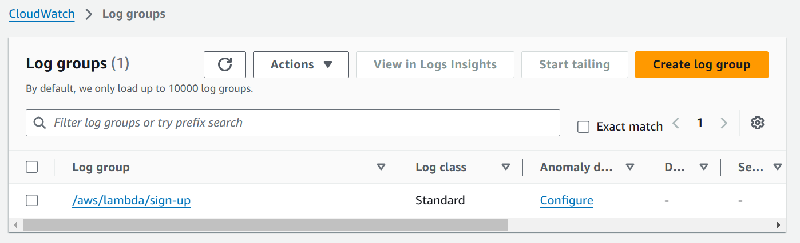

# Amazon CloudWatch

Imagine having a magical dashboard where you can see everything happening across your applications and AWS services, in real-time. That’s Amazon CloudWatch, a smart monitoring tool from AWS!

## Key Features and Benefits

- **Real-Time Insights**: Monitor metrics and logs across your entire stack.
- **Alarms & Alerts**: Stay ahead with notifications for performance issues.
- **Custom Dashboards**: Visualize key data in a way that makes sense for you.
- **Seamless Integration**: Works with AWS services like EC2, Lambda, and more.
- **Troubleshooting Made Easy**: Explore the logs to pinpoint root causes quickly.

## Create a log group in CloudWatch Logs

CloudWatch automatically creates **log groups** while receives log events from AWS services.However, you also have the flexibility to create custom log groups manually for better organization or specific use cases. Here’s how:

1. Open the CloudWatch console at https://console.aws.amazon.com/cloudwatch/.

2. In the navigation pane, choose Log groups.

3. Choose Actions, and then choose Create log group.

4. Enter a name for the log group, and then choose Create log group.

This is an example of a log group for one my lambda functions called `sign-up`

Every time this function is invoked, CloudWatch automatically generates and stores the corresponding logs in a `log stream` in its associated log group. These logs include details about the execution, such as invocation times, errors, and any custom logs you’ve added within the function.

## 📚 Further Reading

- **[Amazon CloudWatch Overview](https://aws.amazon.com/cloudwatch/)**  
  Official AWS documentation on Amazon CloudWatch, its use cases, and features.

- **[Boto3 CloudWatch Service Reference](https://boto3.amazonaws.com/v1/documentation/api/latest/reference/services/cloudwatch.html)**  
  Boto3 documentation for interacting with AWS CloudWatch using the AWS SDK for Python (Boto3).

- **[Working with log groups and log streams](https://docs.aws.amazon.com/AmazonCloudWatch/latest/logs/Working-with-log-groups-and-streams.html)**
