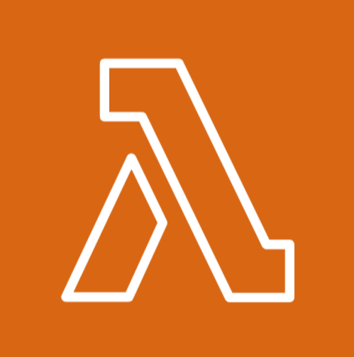

# AWS Lambda



## Overview

AWS Lambda is a serverless compute service that allows you to run code in response to events without managing servers. Simply upload your function code, and Lambda takes care of the rest.

## Functions

Lambda functions are triggered by events such as API calls, file uploads to `S3`, or messages from services like SNS. Functions are stateless by default, meaning they don’t retain information between executions. AWS also supports stateful workflows using services like `DynamoDB` or `Step Functions`.

## Benefits of Serverless:

- **No Server Management**: Focus on writing code without dealing with infrastructure.
- **Automatic Scaling**: Functions automatically scale to handle any level of traffic.
- **Cost-Efficient**: You only pay for the compute time when your code runs.

## Example: Writing an AWS Lambda Function in Python

The [AWS Lambda with Python documentation](https://docs.aws.amazon.com/lambda/latest/dg/lambda-python.html) includes the following example code snippet for writing a Lambda function in Python:

```python
import boto3
import botocore

def lambda_handler(event, context):
    print(f'boto3 version: {boto3.__version__}')
    print(f'botocore version: {botocore.__version__}')
```

In this example, the `boto3` library is used, which is the AWS SDK (Software Development Kit) for Python. This library allows your Python applications to interact with various AWS services, such as Lambda, S3, and EC2. The code also imports `botocore`, which is a low-level library that `boto3` relies on for making API requests to AWS services.

## Creating a Lambda Function

To create a Lambda function, you need a deployment package. The deployment package is a .zip file archive or container image that contains your function code and any external libraries used in the code.

### Steps to Create the `.zip` File

1. **Save your Python code in a file, for example, `lambda_function.py`.**
2. **Install Dependencies**
   If your function has external dependencies, list them in a `requirements.txt` file. To generate `requirements.txt` from an existing project, run:

```bash
pip freeze > requirements.txt
```

`Note`: Exclude boto3 from the file to reduce the package size, since it is already included in the AWS Lambda Python runtime environment.

```bash
pip uninstall boto3 -y
```

3. **Install Dependencies Locally**
   Create a directory for your function and install the dependencies into that directory:

```bash
mkdir my-lambda-function
pip install -r requirements.txt -t my-lambda-function/
```

4. **Add Your Function Code**
   Copy your lambda_function.py file into the same directory:

```bash
cp lambda_function.py my-lambda-function/
```

5. **Create the .zip File**
   Package the directory into a .zip file:

```bash
cd my-lambda-function
zip -r ../my-lambda-function.zip .
cd ..
```

### What's Next?

There are multiple ways to create your Lambda function once the package is ready, including:

1. **Manually via the AWS Console**: Upload the `.zip` file directly through the AWS Management Console.
2. **AWS Command Line Interface (CLI)**: Use CLI commands to create and deploy your Lambda function.
3. **Infrastructure as Code (IaC) Tools**: Automate the creation of Lambda functions using tools like Terraform, AWS CloudFormation.

### Why Avoid Manual Deployments via the Console?

While the AWS Console provides a simple and intaractive interface for creating Lambda functions, it is **not recommended** for production deployments due to the following reasons:

- **Role Attachments**: Each Lambda function requires an IAM role with appropriate permissions. Configuring roles manually in the console can lead to errors or inconsistent configurations.
- **Reproducibility**: Deploying via the console lacks automation and version control, making it difficult to reproduce configurations across environments.
- **Scalability**: IaC tools simplify managing multiple Lambda functions and their dependencies.

## Installing boto3

If you're testing or developing your Lambda function locally, you will need to install the `boto3` library using pip. Run the following command:

```bash
pip install boto3
```

## 📚 Further Reading

- **[AWS Lambda Overview](https://aws.amazon.com/lambda/)**  
  Official AWS documentation on AWS Lambda, its use cases, and features.

- **[Boto3 Lambda Service Reference](https://boto3.amazonaws.com/v1/documentation/api/latest/reference/services/lambda.html)**  
  Boto3 documentation for interacting with AWS Lambda using the AWS SDK for Python (Boto3).

- **[Using AWS Lambda with Python](https://docs.aws.amazon.com/lambda/latest/dg/lambda-python.html)**  
  AWS documentation on how to develop AWS Lambda functions using Python.
