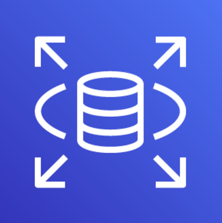

# Amazon Relational Database Service (RDS)

## Overview

Amazon RDS (Relational Database Service) is a fully managed service that simplifies the setup, operation, and scaling of relational databases in the cloud. RDS supports popular database engines, enabling users to choose the one that best fits their application’s needs.

## Supported Database Engines

Amazon RDS supports several database engines:

- MySQL
- PostgreSQL
- Oracle
- Microsoft SQL Server
- MariaDB
- Amazon Aurora (MySQL and PostgreSQL compatible)

## Key Features

- **Automated Backups:** Automatically managed, including point-in-time recovery.
- **Monitoring and Metrics:** Integration with Amazon CloudWatch for detailed insights.
- **High Availability with Multi-AZ:** Ensures reliability through automatic failover and replication.
- **Performance and Scaling:** Easily modify instance types or storage capacity without downtime.

## Use Cases

Amazon RDS is suitable for applications that require:

- Complex queries and transactions
- High data integrity with ACID compliance
- Enterprise applications needing strong data consistency

## Creating a DB instance

You can create an Amazon RDS DB instance using the AWS Management Console, the AWS CLI, or the RDS API.
To Read more about this, please refer to the documentation [here](https://docs.aws.amazon.com/AmazonRDS/latest/UserGuide/USER_CreateDBInstance.html)

## 📚 Further Reading

- **[AWS RDS](https://aws.amazon.com/rds/)**  
  An overview of the service

- **[Boto3 RDS Service Reference](https://boto3.amazonaws.com/v1/documentation/api/latest/reference/services/rds.html#client)**  
  Boto3 documentation for interacting with AWS RDS using the AWS SDK for Python (Boto3).
